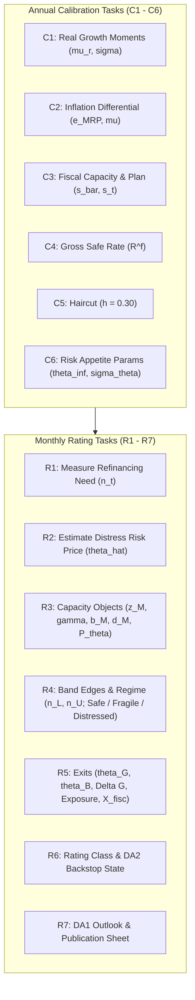

# Minimal Rating Process (MRP v1.0) — Sovereign Credit Rating Skill

This skill executes sovereign credit ratings following **The Minimal Rating Process: Sovereign Credit Ratings from Risk-Off Positioning** (Alex Stomper, HU Berlin, MRP spec v1.0, August 2026).

The organizing idea: countries differ in how they are positioned for risk-off — episodes in which the market’s willingness to bear risk falls — and this positioning determines sovereign credit risk.

### Four Disciplining Principles:
1. **Rate the coordinates, not the price**: Inside the fragile region, two market spreads are consistent with the same fundamentals. The MRP rates the coordinate $(n_t, \hat{\theta}_t)$ relative to the fold.
2. **Measure positioning in units of one global factor**: All distances are denominated in units of $\theta$ (market price of distress risk) and converted into probabilities under the factor distribution $\mathcal{N}(\theta_\infty, \sigma_\theta^2)$.
3. **Replicability**: Deterministic function of published parameters and public code.
4. **Discretion calibrates or warns; it never scores**: Judgment informs calibration tasks (within documented ranges) and the published outlook (DA1); **it never moves a rating class (No-Notch Rule)**.

---

## Workflow Overview: Six Calibration Tasks + Seven Rating Tasks



---

## Step-by-Step Execution Guide

### Step 1: Run Quantitative MRP Rating Pipeline
Execute the Python rating runner against the local read-only DuckDB database:

```bash
/Users/pkc/Projects/sovereign-credit-rating/.venv/bin/python /Users/pkc/Projects/sovereign-credit-rating/scripts/run_rating.py \
  --country <ISO3> \
  --as-of <YYYY-MM-DD> \
  --json
```

The script evaluates:
1. **Calibration Tasks (C1–C6)**:
   - **C1**: Sample moments of log real GDP growth $\hat{\mu}_r, \hat{\sigma}$ over $T=25$ years.
   - **C2**: Asymmetric inflation differential $e_{\text{MRP}} = \min\{0, \hat{e}_t\}$, $\hat{\mu} = \hat{\mu}_r + \hat{\pi}^u + e_{\text{MRP}}$.
   - **C3**: Demonstrated historical maximum 5-year primary balance $\bar{s}$ and current plan $s_t$.
   - **C4**: 1-year point of ECB AAA yield curve $R^f$.
   - **C5**: Historical restructuring haircut distribution center $h = 0.30$.
   - **C6**: Risk-appetite parameters $(\theta_\infty, \sigma_\theta) = (0.30, 0.25)$ and 20y log-VIX history $(m_V, s_V) = (2.70, 0.40)$.
2. **Rating Tasks (R1–R5)**:
   - **R1**: Gross financing need $n_t \approx \frac{d^{stock}_{t-1} - b^{ST}_{t-1}}{M_{t-1}} + b^{ST}_{t-1} + def_t$.
   - **R2**: Standardized VIX $z_t = (\ln V_t - m_V)/s_V \implies \hat{\theta}_t = \max\{0, \theta_\infty + \sigma_\theta z_t\}$.
   - **R3**: Capacity objects $z_M, \gamma(\hat{\theta}_t), b_M(\hat{\theta}_t), d_M(\hat{\theta}_t)$, and $P_\theta(d)$.
   - **R4**: Analytical stationary roots $z_U < z_L$, band edges $n_L(\hat{\theta}_t), n_U(\hat{\theta}_t)$, regime (Safe / Fragile / Distressed), and branch identification.
   - **R5**: Critical risk prices $\theta_G(n_t), \theta_B(n_t)$, exit distances $\Delta G, \Delta B$, structural tail risk $\text{Exposure} = 1 - \Phi\left(\frac{\theta_G - \theta_\infty}{\sigma_\theta}\right)$, and fiscal exit time $X^{\text{fisc}} = \frac{\max(n_t - n_L(\theta_\infty), 0)}{\bar{s} - s_t}$.
3. **Sensitivity Grid (Task R7)**:
   - 81 corners over $\bar{s} \times h \times \hat{\theta}_t \times n_t$.

---

### Step 2: Qualitative Research via Knowledge Wiki (MCP)

Query the Knowledge Wiki (via `search_knowledge` MCP tool or direct inspection of `wiki/collections/sovereign-credit-rating-factors/<Country>.md`) for qualitative evidence:

1. **EU Fiscal Framework & Excessive Deficit Procedure (EDP)**:
   - Is there an open EDP? Has effective action been assessed as taken by the Council?
   - Commission DSA classification (low / medium / high risk).
2. **Political & Institutional Factors**:
   - Consolidation credibility, coalition stability.
3. **Banking Sector & Financial System**:
   - Domestic bank capital (CET1), domestic sovereign holdings share $\kappa$, CRE / NPL risks.
4. **Investor Base & Maturity Structure**:
   - Portfolio WAM, captive investor presence ($k > 0$).

---

### Step 3: Evaluate Discretionary Adjustments (DA)

#### 1. Task DA2 (in R6): Backstop Eligibility State
Assign $e_{it} \in \{\text{eligible}, \text{watch}, \text{ineligible}\}$ from observable bright lines:
- **`eligible`**: Clean compliance with EU fiscal framework and low-risk Commission DSA.
  - *Effect on Model*: Truncates factor distribution at $\theta_G(n_t)$, deleting bad equilibrium for rating purposes.
- **`watch`**: Open EDP where effective action has been assessed as taken.
  - *Effect on Model*: No factor truncation; informs outlook.
- **`ineligible`**: Non-compliance findings or absence of effective action.
  - *Effect on Model*: No factor truncation; blocks upgrade gate out of distress.

#### 2. Task DA1 (in R7): Discretionary Qualitative Outlook
Determine Outlook $\in \{\text{positive}, \text{stable}, \text{negative}\}$:
- **Base Input**: Sign of projected 12-month change in $\Delta G$ along the announced fiscal path at constant $\theta$.
- **Qualitative Adjustments**: EDP status, captive layer ($k > 0$), banking resilience, political risks.

> [!WARNING]
> **Strict No-Notch Rule**: The Discretionary Outlook (DA1) must never modify the native rating class (e.g., S1 remains S1 even with a negative outlook).

---

### Step 4: Rating Classification (Task R6 Thresholds)

- **Safe**:
  - **S1**: $\text{Exposure} \le 0.01\%$ (Letter benchmark: `AAA/AA+`)
  - **S2**: $\text{Exposure} \le 0.1\%$ (Letter benchmark: `AA/A+`)
  - **S3**: $\text{Exposure} \le 1\%$ (Letter benchmark: `A/BBB+`)
- **Fragile ($G$)**:
  - **F1**: $\text{Exposure} \le 5\% \land X^{\text{fisc}} \le 2\text{y}$ (Letter benchmark: `BBB`)
  - **F2**: $\text{Exposure} \le 15\%$ (Letter benchmark: `BB`)
  - **F3**: $\text{Exposure} \le 30\%$ (Letter benchmark: `B`)
  - **F4**: $\text{Exposure} > 30\%$ (Letter benchmark: `CCC+`)
- **Distressed / Bad Branch ($B$)**:
  - **D1**: $\mathbb{P}[\theta < \theta_B] \ge 25\%$ (Letter benchmark: `CCC`)
  - **D2**: $\mathbb{P}[\theta < \theta_B] < 25\%$ (Letter benchmark: `CC/C`)
  - **D3**: $n_t > n_U(\theta)$ on 90% range (Letter benchmark: `imminent SD`)

---

### Step 5: Generate Publication Sheet

Re-run `scripts/run_rating.py` with the determined DA2 state and DA1 outlook flags (which will automatically export `dist/mrp/<country>.md`):

```bash
/Users/pkc/Projects/sovereign-credit-rating/.venv/bin/python /Users/pkc/Projects/sovereign-credit-rating/scripts/run_rating.py \
  --country <ISO3> \
  --as-of <YYYY-MM-DD> \
  --da2-state <eligible|watch|ineligible> \
  --outlook <positive|stable|negative> \
  --outlook-rationale "<Detailed rationale>" \
  --export-md dist/mrp/<country>.md
```

Present the result to the user formatted as:
1. **Executive Rating Summary Table**: Regime, Native Class, Letter Grade Benchmark, DA2 State, Outlook.
2. **Process on One Page (Table 1 Replication)**: Full audit trail of C1-C6 and R1-R7 tasks.
3. **Sensitivity Grid Analysis**: 81-corner breakdown (Safe / Fragile / Distressed counts, worst-corner exposure).
4. **Qualitative Justification**: Transparent narrative explaining the DA2 state and DA1 outlook under No-Notch discipline.
5. **Publication Sheet Link**: Clickable link to [`dist/mrp/<country>.md`](file:///Users/pkc/Projects/sovereign-credit-rating/dist/mrp/austria.md).
