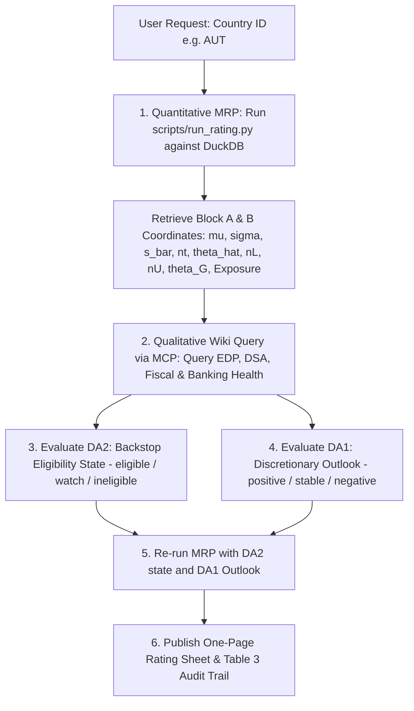

# Sovereign Credit Rating Skill (Stomper 2026)

This skill executes sovereign credit ratings following the **Positioning for Risk-Off** methodology (Alex Stomper, HU Berlin, August 2026).

The methodology cleanly separates:
1. **Minimal Rating Process (MRP)**: Deterministic, replicable quantitative evaluation based on published numbers in DuckDB.
2. **Discretionary Adjustments (DA)**: Qualitative assessment by the LLM querying the Sovereign Rating Wiki via MCP tools.
3. **Principle 4 (No-Notch Discipline)**: Discretion calibrates inputs (DA2 backstop eligibility truncation) or informs the published outlook (DA1), but **never moves a rating class or score directly**.

---

## Rating Workflow



---

## Step-by-Step Execution Guide

### Step 1: Quantitative MRP Data Retrieval & Calculation

Execute the Python rating runner against the local DuckDB database:

```bash
/Users/pkc/Projects/sovereign-credit-rating/.venv/bin/python /Users/pkc/Projects/sovereign-credit-rating/scripts/run_rating.py --country <ISO3> --as-of <YYYY-MM-DD> --json
```

The script evaluates:
- **Block A (Fundamentals)**:
  - $\hat{\mu}, \hat{\sigma}$: 25-year nominal GDP log growth moments (Eq. 11).
  - $\bar{s}$: Best sustained 5-year average primary balance (Eq. 12).
  - $R^f$: 1-year safe gross rate (ECB AAA curve / own curve).
  - $h$: Baseline restructuring haircut ($0.30$).
  - $z_M$: Negative root of $\sigma(1 - \Phi(z_M)) = \phi(z_M)$.
  - $\gamma(\hat{\theta}_t), b_M(\hat{\theta}_t), d_M(\hat{\theta}_t)$: Capacity objects (Eq. 13).
  - $P_\theta(d)$: Default probability function (Eq. 14).
- **Block B (State of Affairs)**:
  - $n_t$: Gross financing need (% of GDP) from debt stock, short-term debt, WAM, and deficit (Eq. 15).
  - $\hat{\theta}_t$: Global distress risk price from 20-year standardized VIX (Eq. 16–17).
  - $n_L(\hat{\theta}_t), n_U(\hat{\theta}_t)$: Stationary points of funding curve $\xi'_\theta(d) = 0$ (Eq. 6).
  - Regime assignment: **Safe** ($n_t < n_L$), **Fragile** ($n_L \le n_t \le n_U$), **Distressed** ($n_t > n_U$).
  - Critical exit prices $\theta_G(n_t), \theta_B(n_t)$ (Eq. 8).
  - Exit distances $\Delta G = \theta_G - \hat{\theta}_t, \Delta B = \hat{\theta}_t - \theta_B$ (Eq. 9).
  - Tail risk $Exposure = P[\theta > \theta_G(n_t)]$ (Eq. 10).
  - Fiscal exit time $X^{fisc} = \frac{\max(n_t - n_L(\theta_\infty), 0)}{\bar{s} - s_t}$ (Eq. 18).
- **Block C (Base Scoring)**:
  - Threshold mapping to native classes:
    - Safe: **S1** ($Exposure \le 0.01\%$), **S2** ($\le 0.1\%$), **S3** ($\le 1\%$).
    - Fragile: **F1** ($Exposure \le 5\%$ & $X^{fisc} \le 2y$), **F2** ($\le 15\%$), **F3** ($\le 30\%$), **F4** ($> 30\%$).
    - Distressed: **D1** ($P[\theta < \theta_B] \ge 25\%$), **D2** ($< 25\%$), **D3** ($n_t > n_U(\theta)$ across factor's 90% range).
  - 81-corner sensitivity grid over $(\bar{s}, h, \hat{\theta}_t, n_t)$.

---

### Step 2: Qualitative Research via Knowledge Wiki / MCP

Query the Knowledge Wiki (via `search_knowledge` MCP tool or direct inspection of `wiki/collections/sovereign-credit-rating-factors/<Country>.md` and `wiki/collections/methods/`) to collect qualitative evidence on:

1. **EU Fiscal Governance & Excessive Deficit Procedure (EDP)**:
   - Is there an open EDP?
   - Has effective action been assessed as taken by the Council / Commission?
   - What is the Commission DSA risk classification (low / medium / high)?
2. **Political & Institutional Stability**:
   - Government coalition stability, commitment to fiscal consolidation, rule of law.
3. **Banking Sector & Financial Health**:
   - CET1 capitalization, domestic bank sovereign holdings share $\kappa$, commercial real estate (CRE) or non-performing loans (NPLs).
4. **Investor Base & Maturity Structure**:
   - Weighted average maturity (WAM), domestic vs foreign nonbank base.

---

### Step 3: Evaluate Discretionary Adjustments (DA)

#### 1. Task DA2: Backstop Eligibility State
Assign $e_{it} \in \{\text{eligible}, \text{watch}, \text{ineligible}\}$ based on objective bright lines:
- **`eligible`**: Clean compliance with EU fiscal framework and low-risk Commission DSA.
  - *Effect on Model*: Truncates the factor distribution at $\theta_G(n_t)$, deleting the bad equilibrium for rating purposes.
- **`watch`**: Open Excessive Deficit Procedure (EDP) where effective action has been assessed as taken.
  - *Effect on Model*: No factor truncation; full Exposure calculated; informs outlook.
- **`ineligible`**: Non-compliance findings or absence of effective action.
  - *Effect on Model*: No factor truncation; blocks C3 upgrade gate out of distress.

#### 2. Task DA1: Discretionary Qualitative Outlook
Determine Outlook $\in \{\text{positive}, \text{stable}, \text{negative}\}$ by combining:
- **(a) Model-Based Trajectory**: The projected 12-month evolution of $\Delta G$ along the announced $n$-path (rising deficits/debt shrink $\Delta G$).
- **(b) Beyond-Model Qualitative Signals**: Institutional reforms, EDP status, banking sector resilience, and demographic expenditure pressures.

> [!WARNING]
> **Strict No-Notch Rule**: The Discretionary Outlook (DA1) must never modify the native rating class (e.g., S1 remains S1 even with a negative outlook).

---

### Step 4: Generate Publication Sheet & Audit Trail

Re-run `scripts/run_rating.py` with the determined DA2 state and DA1 outlook flags (which will automatically export `dist/mrp/<country>.md`):

```bash
/Users/pkc/Projects/sovereign-credit-rating/.venv/bin/python /Users/pkc/Projects/sovereign-credit-rating/scripts/run_rating.py \
  --country <ISO3> \
  --as-of <YYYY-MM-DD> \
  --da2-state <eligible|watch|ineligible> \
  --outlook <positive|stable|negative> \
  --outlook-rationale "<Detailed rationale>" \
  --export-md dist/mrp/<country>.md
```

Present the result to the user formatted as:
1. **Rating Summary Table**: Regime, Native Class, Letter Grade Benchmark, DA2 State, Outlook.
2. **Audit Trail (Table 3 Reproduction)**: Exact object values, formulas, and data sources.
3. **Sensitivity Grid Analysis**: 81-corner breakdown (Safe / Fragile / Distressed counts, worst-corner exposure).
4. **Qualitative Justification**: Transparent narrative explaining the DA2 state and DA1 outlook.
5. **Publication Sheet**: Link to the generated markdown publication file in `dist/mrp/<country>.md`.
