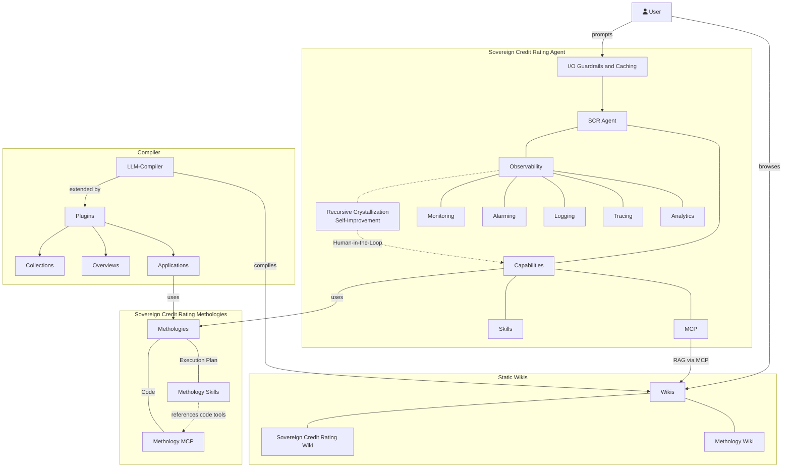

# Humboldt Universität: High-Standard & Rich Sovereign Credit Rating

## System Overview



## LLM Compiler

https://github.com/pkcpkc/mycelium-mind

### Switching between local and npmjs mycelium-mind

For development, you can toggle between using your local clone of `mycelium-mind` and the version published on npmjs:

- **Use local mycelium-mind:**

  ```bash
  # Ensure local changes are built in your mycelium-mind directory:
  # (In /Users/pkc/Projects/mycelium-mind): npm run build

  # Then in this repository:
  mise exec -- npm run link:local
  ```

- **Use published npmjs package:**
  ```bash
  mise exec -- npm run link:npm
  ```

## RAG

- Serves the LLM-Wiki content
- https://github.com/lyonzin/knowledge-rag via mycelium-mind
  - **Your docs, your machine, zero cloud.** Claude Code searches them natively.
    Drop your PDFs, markdown, code, notebooks — 1800+ files, 39K chunks, indexed in under 3 minutes.
    Hybrid search (BM25 + semantic vectors + cross-encoder reranking) through 13 MCP tools.
    Everything runs locally via ONNX. No Docker, no Ollama, no API keys, no data leaves your machine.
  - v4.0.0 — Enterprise concurrent access: **SSE/HTTP transport (1 server → N clients)**, thread-safe shared state, optional rate limiting + Prometheus metrics, ChromaDB WAL mode, --transport CLI

## MCP

- Provides access to financial data via DuckDB
- https://github.com/motherduckdb/mcp-server-motherduck
- Maybe a custom MCP, that returns all (or grouped) financial data of one country by country code would be more efficient in agentic use!

## Skills

- SVR methods

### Using with OpenCode

This repository includes a pre-configured `opencode.json` file that links the RAG command to **OpenCode** as a local MCP server.

When you launch OpenCode in this directory:

```bash
opencode
```

It automatically spawns the RAG server in `stdio` mode, indexes the files in the `wiki/` directory, and connects to the server tools (such as `search_knowledge`), making your offline wiki directly accessible inside the session.

## OpenAI API Settings

- https://ki.cms.hu-berlin.de/de/apis
  - llm3: Qwen/Qwen3.6-27B-FP8

## VPN Settings

https://www.cms.hu-berlin.de/de/dl/netze/vpn
