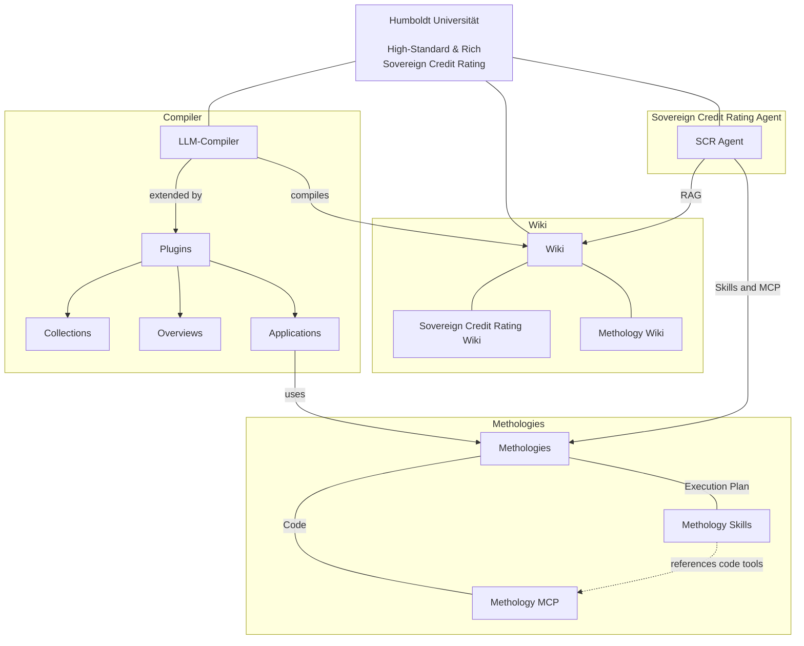

# Humboldt Universität: High-Standard & Rich Sovereign Credit Rating

## System Overview

## LLM Compiler

https://github.com/pkcpkc/mycelium-mind

## RAG

- https://github.com/lyonzin/knowledge-rag
  - **Your docs, your machine, zero cloud.** Claude Code searches them natively.
    Drop your PDFs, markdown, code, notebooks — 1800+ files, 39K chunks, indexed in under 3 minutes.
    Hybrid search (BM25 + semantic vectors + cross-encoder reranking) through 13 MCP tools.
    Everything runs locally via ONNX. No Docker, no Ollama, no API keys, no data leaves your machine.
  - v4.0.0 — Enterprise concurrent access: **SSE/HTTP transport (1 server → N clients)**, thread-safe shared state, optional rate limiting + Prometheus metrics, ChromaDB WAL mode, --transport CLI

## OpenAI API Settings

- https://ki.cms.hu-berlin.de/de/apis
  - llm3: Qwen/Qwen3.6-27B-FP8

## VPN Settings

https://www.cms.hu-berlin.de/de/dl/netze/vpn
