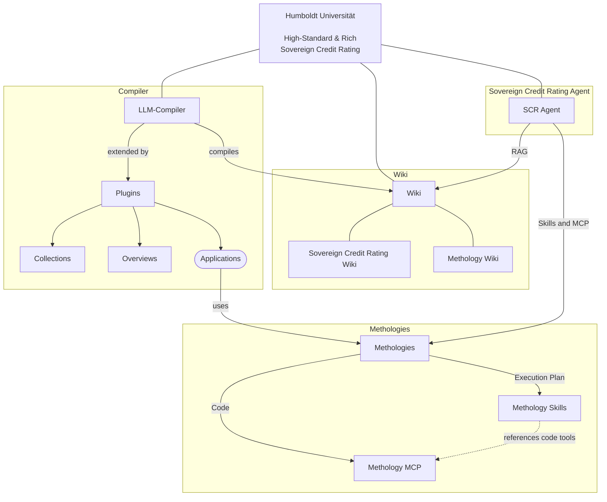

# Humboldt Universität: High-Standard & Rich Sovereign Credit Rating

## System Overview

```mermaid
flowchart TD
    HSR[Humboldt Universität\n\n High-Standard & Rich Sovereign Credit Rating]

    C[LLM-Compiler]
    P[Plugins]
    PC[Collections]
    PO[Overviews]
    PA([Applications])

    W[Wiki]

    A[SCR Agent]

    M[Methologies]
    MS[Methology Skills]
    MC[Methology MCP]


    HSR --- C
    HSR --- W
    HSR --- A

    subgraph Wiki
        W --- SCRW[Sovereign Credit Rating Wiki]
        W --- MW[Methology Wiki]
    end

    subgraph Methologies
        M-- Execution Plan -->MS
        M-- Code -->MC
        MS-. references code tools .->MC
    end

    subgraph Compiler
        C-- extended by -->P
        P-->PC
        P-->PO
        P-->PA
        PA-- uses -->M
        C-- compiles -->W
    end

    subgraph Sovereign Credit Rating Agent
        A-- RAG-->W
        A-- Skills and MCP -->M
    end
```
