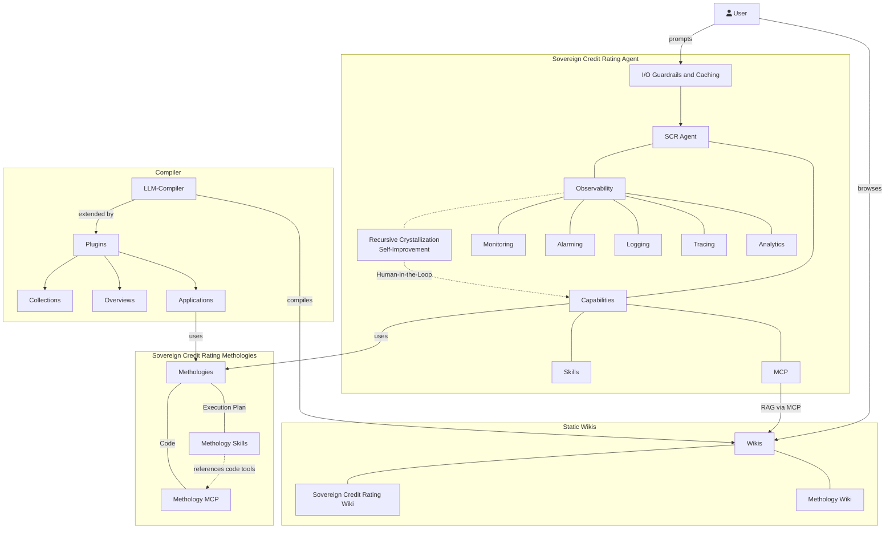

# Humboldt Universität: High-Standard & Rich Sovereign Credit Rating

## System Overview



## LLM Compiler

https://github.com/pkcpkc/mycelium-mind

### Switching between local and npmjs mycelium-mind

For development, you can toggle between using your local clone of `mycelium-mind` and the version published on npmjs:

- **Use local mycelium-mind:**

  ```bash
  # Ensure local changes are built in your mycelium-mind directory:
  # (In /Users/pkc/Projects/mycelium-mind): npm run build

  # Then in this repository:
  mise exec -- npm run link:local
  ```

- **Use published npmjs package:**
  ```bash
  mise exec -- npm run link:npm
  ```

## RAG

- Serves the LLM-Wiki content
- https://github.com/lyonzin/knowledge-rag via mycelium-mind
  - **Your docs, your machine, zero cloud.** Claude Code searches them natively.
    Drop your PDFs, markdown, code, notebooks — 1800+ files, 39K chunks, indexed in under 3 minutes.
    Hybrid search (BM25 + semantic vectors + cross-encoder reranking) through 13 MCP tools.
    Everything runs locally via ONNX. No Docker, no Ollama, no API keys, no data leaves your machine.
  - v4.0.0 — Enterprise concurrent access: **SSE/HTTP transport (1 server → N clients)**, thread-safe shared state, optional rate limiting + Prometheus metrics, ChromaDB WAL mode, --transport CLI

## Open Notebook Integration

Sync your synthesized sovereign credit rating wiki cards (entities, methodologies, country summaries) into an interactive, self-hosted [Open Notebook](https://github.com/lfnovo/open-notebook) workspace powered by SurrealDB.

### Prerequisites (macOS with Colima)

```bash
brew install colima docker docker-compose
```

### Environment Status & Container Lifecycle

You can manage the complete stack directly using npm scripts:

```bash
# Check status of Colima, Docker, containers, and API
npm run notebook:status

# Start Colima runtime + Open Notebook containers
npm run notebook:start

# Stop Open Notebook containers
npm run notebook:stop

# Stop Open Notebook AND shutdown Colima runtime
npx mm notebook stop --colima
```

* **Interactive Web UI:** [http://localhost:8502](http://localhost:8502)
* **API & Swagger Docs:** [http://localhost:5055/docs](http://localhost:5055/docs)

### Configuring AI Models & Providers

To use Open Notebook's interactive capabilities (AI chat, vector search, embeddings, transformations, and audio podcasts), configure your AI providers and default models in the web interface:

1. Open **[http://localhost:8502](http://localhost:8502)** in your browser.
2. In the navigation sidebar, go to **Settings** / **Models & Credentials**.
3. **Add Provider Credentials**:
   * Connect your API key or endpoint for your preferred provider (e.g., **OpenAI**, **Anthropic**, **Google Gemini**, **Groq**, **Mistral**, or local **Ollama** at `http://host.docker.internal:11434`).
4. **Set Default Models for Each Modality**:
   * **Chat / Generation**: Model used for notebook Q&A, source chats, and summary synthesis (e.g., `gpt-4o`, `claude-3-5-sonnet`, `gemini-1.5-pro`, or `qwen2.5`).
   * **Embeddings**: Model used for semantic vector indexing of sources and notes (e.g., `text-embedding-3-small`, `bge-m3`, or `nomic-embed-text`).
   * **Text-to-Speech (TTS)**: Model used for generating podcast audio and speaker discussions (e.g., OpenAI `tts-1`, ElevenLabs, or Edge TTS).
   * **Speech-to-Text (STT)**: Model used for transcribing uploaded audio/video files (e.g., OpenAI `whisper-1`).

### 100% Local & Offline Stack with oMLX (Apple Silicon)

To run **everything 100% locally and offline** without cloud API keys or telemetry, run [oMLX](https://github.com/jundot/omlx) natively on your Mac. Because Open Notebook runs inside Docker while oMLX runs natively on macOS, point Open Notebook to the host bridge URL: **`http://host.docker.internal:8000/v1`**.

#### Recommended Model Roster & Precisions

| Modality | Recommended Model Variant | Unified Memory | Precision Rationale |
| :--- | :--- | :--- | :--- |
| **Embeddings** | **`mlx-community/bge-m3-mlx-fp16`** | ~1.1 GB | **Pick FP16 over 8-bit.** Preserves full vector geometry and cosine distance fidelity across European languages (English, German, French, Italian, Romanian, Hungarian). At 1.1 GB, quantization savings are negligible. |
| **Transcription (STT)** | **`mlx-community/whisper-large-v3-turbo`** | ~1.6 GB | **Pick FP16 over q4.** Large-v3-turbo is already heavily pruned/optimized by OpenAI. 4-bit quantization degrades accuracy on technical acronyms (*ECB, IMF, ESM, GDP*), sovereign debt yields, and non-English accents. |
| **Podcast Voices (TTS)** | **`mlx-community/Kokoro-82M-bf16`** | ~170 MB | **Pick bf16 over 4-bit.** At only 82 million parameters, the whole model is < 170 MB. Quantizing to 4-bit causes robotic clipping, buzzing, and slurred phonemes. bf16 provides broadcast studio fidelity. |
| **Chat & Synthesis (LLM)** | **`mlx-community/Qwen2.5-14B-Instruct-4bit`** *(16-24GB Macs)*<br>or **`mlx-community/Qwen2.5-32B-Instruct-4bit`** *(32-64GB+ Macs)* | ~8.5 GB<br>~19.0 GB | Reused across both Open Notebook chat and Mycelium Mind ingestion compiler (`.env`). Exceptional structured Markdown/YAML generation and quantitative reasoning for sovereign ratings. |

> [!TIP]
> **Zero Redundancy (Unified Memory):** By serving `Qwen2.5` through oMLX, both **Mycelium Mind's ingestion compiler** (`mm sync`) and **Open Notebook's interactive chat** connect to the exact same model instance in unified memory without duplicating weights.
> 
> * **In `sovereign-credit-rating/.env`:**
>   ```bash
>   BASE_MODEL_NAME=mlx-community/Qwen2.5-14B-Instruct-4bit
>   BASE_MODEL_API_URL=http://localhost:8000/v1
>   BASE_MODEL_API_KEY=omlx-local
>   ```
> * **In Open Notebook (`http://localhost:8502`) Settings &rarr; Models:**
>   * **Base URL:** `http://host.docker.internal:8000/v1`
>   * **Chat Model:** `mlx-community/Qwen2.5-14B-Instruct-4bit` *(or alias `agentic`)*
>   * **Embedding Model:** `mlx-community/bge-m3-mlx-fp16`
>   * **STT Model:** `mlx-community/whisper-large-v3-turbo`
>   * **TTS Model:** `mlx-community/Kokoro-82M-bf16` *(or Open Notebook built-in Edge-TTS)*

> [!IMPORTANT]
> **Connecting Open Notebook (Docker) to local oMLX (Mac Host):**
> When configuring the provider in the Open Notebook web UI (*Settings &rarr; Models & Credentials &rarr; Add/Edit Configuration*):
> * **Basis-URL (Base URL):** Must be set to **`http://host.docker.internal:8000/v1`**. Do **not** use `http://127.0.0.1:8000/v1` or `localhost`—inside the Docker container, `127.0.0.1` refers to the container itself, whereas `host.docker.internal` routes network traffic directly to your macOS host where oMLX is listening.
> * **API-Schlüssel (API Key):** Enter your oMLX API key from `~/.omlx/settings.json` (under `auth.api_key`, e.g. `gaqDic-megqah-2qunre`). If oMLX authentication is turned off, any dummy string (e.g. `omlx-local`) will suffice.

> [!TIP]
> **Provider Selection Tip — Configure oMLX under the "OpenAI" Preset:**
> Open Notebook's dedicated "oMLX" preset may only expose Language and Embedding modalities because Open Notebook is not yet aware that modern oMLX servers support TTS (`/v1/audio/speech` with Kokoro) and STT (`/v1/audio/transcriptions` with Whisper).
> 
> To unlock **all four modalities** (Language, Embedding, STT, and TTS) for your local models:
> * Configure your local endpoint under the **OpenAI** provider preset (or an OpenAI-compatible preset with full modalities enabled).
> * Point its Base URL to `http://host.docker.internal:8000/v1` with your oMLX API key.
> * You can now assign local models to all 4 slots: Language (`agentic`), Embedding (`bge-m3-mlx-fp16`), STT (`whisper-large-v3-turbo`), and TTS (`Kokoro-82M-bf16`).

### Syncing the Wiki to Open Notebook

```bash
# Preview sync plan (adds, updates, skips, prunes) without making changes
npm run notebook:push:dry

# Incrementally push wiki collections and summaries to Open Notebook
npm run notebook:push

# Push and prune remote cards that were deleted locally
npm run notebook:push -- --prune
```

The sync is **incremental, idempotent, and stateless**:
* **Idempotent Re-runs:** Re-executing `npm run notebook:push` will automatically skip all unchanged files with **zero re-indexing and zero re-embedding**. Each document's content is SHA-256 fingerprinted. If the local file and remote source match, no network requests or embedding computations are performed.
* **Delta Sync:** If you edit or add a few markdown files, subsequent runs only upload the changed or newly created documents (`To Update` / `To Add`).
* **Force Re-upload:** To bypass the hash check and force re-uploading all documents, pass `--force`:
  ```bash
  npx mm notebook push . --force
  ```

### Configuration (`config/config.yml`)

Sync options are configured under the `notebook` key:

```yaml
notebook:
  target: "[MM] Sovereign Credit Rating"       # Target notebook name in Open Notebook
  url: "http://localhost:5055"                 # Backend API base URL
  filter:
    collections: true                          # Sync entity cards (wiki/collections/)
    summaries: true                            # Sync document summaries (wiki/summaries/)
  concurrency: 1                               # Concurrency limit (1 recommended to prevent SurrealDB transaction conflicts)
```

## Sovereign Credit Rating Methodology (Stomper 2026)

Implementation of **"Positioning for Risk-Off: A Methodology for Sovereign Credit Ratings"** (Alex Stomper, HU Berlin, August 2026).

- **[Quickstart & How-To Guide](docs/how-to.md)**: Step-by-step guide on how to rate a country, where results are stored, and how to use the skill inside OpenCode, Antigravity, and CLI.
- **[Austria Raw Dataset from DuckDB](dist/mrp/austria_data.md)**: Full dataset dump from DuckDB for Austria (Master metadata, parameters, debt state, 25-year GDP growth, 25-year primary balances, and global VIX state).
- **[Sovereign Credit Rating Skill Guide](docs/mrp-skill.md)**: Complete guide on the agent skill, theoretical foundations, mathematical workflow (Blocks A, B, and C), Discretionary Adjustments (DA2 Backstop Eligibility, DA1 Qualitative Outlook), and Principle 4 (No-Notch discipline).
- **[DuckDB Database Schema Specification](docs/duckdb-schema.md)**: Full relational schema, table fields, constraints, and Austria reference dataset (August 2026 calibration).
- **[Rating Engine & Script Architecture](docs/rating-engine-script.md)**: Core Python mathematical engine (`src/mrp/engine.py`), analytical stationary points solver, 81-corner sensitivity grid, and CLI runner (`scripts/run_rating.py`).

### Quick Start: Running a Sovereign Rating

```bash
# 1. Initialize DuckDB relational schema (read-only input store)
./.venv/bin/python scripts/init_duckdb.py

# 2. Insert baseline country dataset (Austria)
./.venv/bin/python scripts/insert_austria.py

# 3. Execute rating pipeline (exports publication markdown to dist/mrp/austria.md)
./.venv/bin/python scripts/run_rating.py --country AUT --as-of 2026-08-01
```

## MCP & RAG

- **Knowledge RAG via MCP**: Serves the LLM-Wiki content. Connects via `opencode.json` or mycelium-mind CLI (`mm rag . --transport stdio`).
- **Financial Data via DuckDB**: Local DuckDB instance (`data/sovereign_ratings.duckdb`) providing sovereign debt, GDP growth series, and global risk pricing factor history.

## Skills

- **`sovereign-credit-rating`** (`.agents/skills/sovereign-credit-rating/SKILL.md`): Orchestrates DuckDB quantitative calculation + Wiki MCP qualitative research + Discretionary Adjustments + Table 3 Audit Trail generation.

### Using with OpenCode

This repository includes a pre-configured `opencode.json` file that links the RAG command to **OpenCode** as a local MCP server.

When you launch OpenCode in this directory:

```bash
opencode
```

It automatically spawns the RAG server in `stdio` mode, indexes the files in the `wiki/` directory, and connects to the server tools (such as `search_knowledge`), making your offline wiki directly accessible inside the session.

## OpenAI API Settings

- https://ki.cms.hu-berlin.de/de/apis
  - llm3: Qwen/Qwen3.6-27B-FP8

## VPN Settings

https://www.cms.hu-berlin.de/de/dl/netze/vpn
