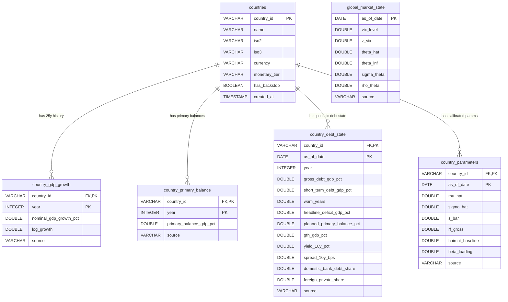

# DuckDB Database Schema Specification

This document details the relational schema implemented in **DuckDB** (`data/sovereign_ratings.duckdb`) for the Sovereign Credit Rating methodology (Stomper 2026).

---

## 1. Schema Architecture & ER Diagram



> [!NOTE]
> **Read-Only Architecture**: The DuckDB database serves strictly as a read-only store for sovereign fundamentals, debt state, and global risk factors. Rating evaluation runs are generated as reproducible markdown publication sheets (in `dist/mrp/`) and are not written to the database.

---

## 2. Table Specifications

### 2.1 `countries` (Master Sovereign Metadata)
Stores sovereign master metadata, monetary arrangement, and constitutional backstop status.

| Column | Data Type | Constraint | Description |
| :--- | :--- | :--- | :--- |
| `country_id` | `VARCHAR` | `PRIMARY KEY` | ISO-3 country identifier (e.g. `'AUT'`) |
| `name` | `VARCHAR` | `NOT NULL` | Country name (e.g. `'Austria'`) |
| `iso2` | `VARCHAR(2)` | `NOT NULL` | ISO-2 country code (e.g. `'AT'`) |
| `iso3` | `VARCHAR(3)` | `NOT NULL` | ISO-3 country code (e.g. `'AUT'`) |
| `currency` | `VARCHAR(3)` | `NOT NULL` | Borrowing currency code (e.g. `'EUR'`) |
| `monetary_tier` | `VARCHAR` | `NOT NULL` | `'euro_area'` (full application) or `'own_currency'` (modified application) |
| `has_backstop` | `BOOLEAN` | `NOT NULL DEFAULT TRUE` | Backstop presence flag |
| `created_at` | `TIMESTAMP` | `DEFAULT CURRENT_TIMESTAMP` | Record timestamp |

### 2.2 `country_gdp_growth` (Task A1 Growth Series)
Stores the historical nominal GDP growth series used to estimate sample moments $\hat{\mu}$ and $\hat{\sigma}$.

| Column | Data Type | Constraint | Description |
| :--- | :--- | :--- | :--- |
| `country_id` | `VARCHAR` | `PK, FK -> countries(country_id)` | Country ID |
| `year` | `INTEGER` | `PK` | Year of observation ($2001-2025$) |
| `nominal_gdp_growth_pct` | `DOUBLE` | `NOT NULL` | Nominal GDP growth rate in percent (e.g. `3.4`) |
| `log_growth` | `DOUBLE` | `NOT NULL` | Natural log gross growth $\ln G_t = \ln(1 + g/100)$ |
| `source` | `VARCHAR` | | Public data source (e.g. `'IMF WEO'`) |

### 2.3 `country_primary_balance` (Task A2 Primary Balance Series)
Stores historical primary balances (share of GDP) used to calculate maximum sustainable capacity $\bar{s} = \max_t \frac{1}{5}\sum_{j=t-4}^t pb_j$.

| Column | Data Type | Constraint | Description |
| :--- | :--- | :--- | :--- |
| `country_id` | `VARCHAR` | `PK, FK -> countries(country_id)` | Country ID |
| `year` | `INTEGER` | `PK` | Year of observation |
| `primary_balance_gdp_pct` | `DOUBLE` | `NOT NULL` | Primary balance as % of GDP |
| `source` | `VARCHAR` | | Source (e.g. `'IMF WEO / Fiscal Monitor'`) |

### 2.4 `country_debt_state` (Task B1/B2 State of Affairs)
Stores point-in-time debt stock, maturity structure, borrowing costs, and gross financing needs ($n_t$).

| Column | Data Type | Constraint | Description |
| :--- | :--- | :--- | :--- |
| `country_id` | `VARCHAR` | `PK, FK -> countries(country_id)` | Country ID |
| `as_of_date` | `DATE` | `PK` | Reporting date (e.g. `'2026-08-01'`) |
| `year` | `INTEGER` | `NOT NULL` | Reference year (`2026`) |
| `gross_debt_gdp_pct` | `DOUBLE` | `NOT NULL` | Gross debt ratio $d^{stock}_{t-1}$ (e.g. `81.0`) |
| `short_term_debt_gdp_pct` | `DOUBLE` | `NOT NULL` | Short-term debt stock $b^{ST}_{t-1}$ (e.g. `2.0`) |
| `wam_years` | `DOUBLE` | `NOT NULL` | Weighted average maturity $M_{t-1}$ (e.g. `11.45`) |
| `headline_deficit_gdp_pct` | `DOUBLE` | `NOT NULL` | Headline deficit $def_t$ (e.g. `4.3`) |
| `planned_primary_balance_pct` | `DOUBLE` | `NOT NULL` | Planned primary balance $s_t$ (e.g. `-2.4`) |
| `gfn_gdp_pct` | `DOUBLE` | `NOT NULL` | Gross financing need $n_t$ (e.g. `14.0`) |
| `yield_10y_pct` | `DOUBLE` | | Benchmark 10y yield (e.g. `2.50`) |
| `spread_10y_bps` | `DOUBLE` | | Observed spread over safe curve in bps (`50.0`) |
| `domestic_bank_debt_share` | `DOUBLE` | | Domestic bank holding share $\kappa$ (`0.15`) |
| `foreign_private_share` | `DOUBLE` | | Foreign private investor share (`0.35`) |
| `source` | `VARCHAR` | | Data source |

### 2.5 `country_parameters` (Pre-Calibrated Baseline Inputs)
Stores published baseline parameter vectors for direct auditability.

| Column | Data Type | Constraint | Description |
| :--- | :--- | :--- | :--- |
| `country_id` | `VARCHAR` | `PK, FK -> countries(country_id)` | Country ID |
| `as_of_date` | `DATE` | `PK` | Calibration date |
| `mu_hat` | `DOUBLE` | `NOT NULL` | Estimated log growth drift $\hat{\mu}$ (`0.034`) |
| `sigma_hat` | `DOUBLE` | `NOT NULL` | Estimated log growth volatility $\hat{\sigma}$ (`0.030`) |
| `s_bar` | `DOUBLE` | `NOT NULL` | Fiscal capacity $\bar{s}$ (`0.020`) |
| `rf_gross` | `DOUBLE` | `NOT NULL` | 1-year safe gross rate $R^f$ (`1.02`) |
| `haircut_baseline` | `DOUBLE` | `NOT NULL` | Haircut parameter $h$ (`0.30`) |
| `beta_loading` | `DOUBLE` | `DEFAULT 1.0` | Factor sensitivity $\beta_i$ (`1.0`) |
| `source` | `VARCHAR` | | Parameter source |

### 2.6 `global_market_state` (Task B3 Global Risk Price $\hat{\theta}_t$)
Stores monthly global risk appetite metrics and VIX standardization.

| Column | Data Type | Constraint | Description |
| :--- | :--- | :--- | :--- |
| `as_of_date` | `DATE` | `PRIMARY KEY` | Month-end date |
| `vix_level` | `DOUBLE` | `NOT NULL` | Monthly average CBOE VIX index (`15.5`) |
| `z_vix` | `DOUBLE` | `NOT NULL` | 20-year standardized log VIX $z_t$ (`0.0`) |
| `theta_hat` | `DOUBLE` | `NOT NULL` | Distress risk price $\hat{\theta}_t = \max(0, \theta_\infty + \sigma_\theta z_t)$ (`0.30`) |
| `theta_inf` | `DOUBLE` | `DEFAULT 0.30` | Long-run anchor $\theta_\infty$ |
| `sigma_theta` | `DOUBLE` | `DEFAULT 0.25` | Dispersion parameter $\sigma_\theta$ |
| `rho_theta` | `DOUBLE` | `DEFAULT 1.0` | Persistence parameter $\rho_\theta$ |
| `source` | `VARCHAR` | | Data source |

---

## 3. Austria Reference Dataset (August 2026)

| Parameter / Object | Database Value | Source Citation in Paper |
| :--- | :--- | :--- |
| $\hat{\mu}, \hat{\sigma}$ | `0.034, 0.030` | IMF WEO nominal GDP series 2001–2025 |
| $\bar{s}$ | `0.020` (2.0%) | IMF WEO / Fiscal Monitor primary balance history |
| $s_t$ | `-0.024` (-2.4%) | 2026 planned primary balance forecast |
| $R^f$ | `1.02` (2.0%) | 1-year ECB euro-area AAA yield curve |
| $h$ | `0.30` | Cruces–Trebesch restructuring haircut center |
| $d^{stock}_{t-1}$ | `81.0%` | Gross government debt (% of GDP) |
| $b^{ST}_{t-1}$ | `2.0%` | Short-term debt stock (% of GDP) |
| $M_{t-1}$ (WAM) | `11.45` years | OeBFA investor presentation / OECD GDR |
| $def_t$ | `4.3%` | 2026 general government headline deficit |
| $n_t$ (GFN) | `14.0%` | Baseline refinancing need ($6.9 + 2.0 + 4.3 = 13.2\% \to 14.0\%$) |
| $\hat{\theta}_t$ | `0.30` | August 2026 VIX near 20y log-mean ($z_t \approx 0$) |

---

## 4. Example SQL Queries

```sql
-- Query country debt state and parameters
SELECT 
    c.name,
    p.mu_hat, p.sigma_hat, p.s_bar, p.rf_gross, p.haircut_baseline,
    d.gross_debt_gdp_pct, d.wam_years, d.gfn_gdp_pct
FROM countries c
JOIN country_parameters p ON c.country_id = p.country_id
JOIN country_debt_state d ON c.country_id = d.country_id
WHERE c.country_id = 'AUT';
```
