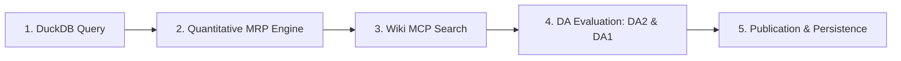

# Sovereign Credit Rating — Quickstart & How-To Guide

This guide explains how to use the Sovereign Credit Rating skill to evaluate countries, where to find the results, and how to run it inside **OpenCode**, **Antigravity**, or directly from the **command line**.

---

## 1. Using the Skill for a Specific Country

### Triggering the Skill in Natural Language
When chatting with your AI assistant in **OpenCode** or **Antigravity**, simply prompt:
- *"Run sovereign credit rating for Austria"*
- *"Rate AUT as of August 2026"*
- *"Execute the MRP methodology for Austria and apply discretionary adjustments"*

### What the Skill Does Automatically


1. **Quantitative Data Pull (DuckDB)**: Fetches historical GDP growth (25y series), primary balances ($\bar{s}$), debt stock, maturity (WAM), deficit, gross financing need ($n_t$), and global risk appetite factor ($\hat{\theta}_t$).
2. **Mathematical MRP Solve**: Evaluates capacity objects ($\gamma, b_M, d_M$), band edges ($n_L, n_U$), critical prices ($\theta_G, \theta_B$), exit distances ($\Delta G, \Delta B$), structural tail risk ($Exposure$), and the 81-corner sensitivity grid.
3. **Qualitative Research (Wiki via MCP)**: Queries the Knowledge Wiki for Excessive Deficit Procedure (EDP) status, Commission DSA classification, banking health, and political stability.
4. **Discretionary Adjustments (DA)**:
   - **DA2 (Backstop Eligibility)**: Assigns `eligible`, `watch`, or `ineligible` (truncates factor distribution only if `eligible`).
   - **DA1 (Outlook)**: Evaluates $n$-path direction + qualitative risks $\to$ `positive`, `stable`, or `negative`.
   - **No-Notch Discipline**: Discretion never modifies the native rating class directly.
5. **Publication**: Automatically generates a reproducible markdown publication sheet saved to `dist/mrp/<country>.md`.

---

## 2. Where to Find the Results

The skill outputs results in two locations:

1. **Interactive Chat Response**:
   - Executive Rating Summary (Regime, Native Class, Letter Grade, Backstop Eligibility, Outlook).
   - Replicated **Table 3 Audit Trail** with exact formulas, input sources, and numbers.
   - **81-Corner Sensitivity Grid** analysis (Safe / Fragile / Distressed counts and worst corner).
2. **Markdown Publication Sheet**:
   - Saved automatically to: **`dist/mrp/<country>.md`** (e.g. [`dist/mrp/austria.md`](file:///Users/pkc/Projects/sovereign-credit-rating/dist/mrp/austria.md)).

---

## 3. How to Use with OpenCode

[OpenCode](https://opencode.ai) uses the repository's [`opencode.json`](file:///Users/pkc/Projects/sovereign-credit-rating/opencode.json) and `.agents/skills/` directory.

### Setup & Launch
1. Open your terminal in the repository directory:
   ```bash
   cd /Users/pkc/Projects/sovereign-credit-rating
   ```
2. Start OpenCode:
   ```bash
   opencode
   ```
3. OpenCode automatically:
   - Spawns the Knowledge RAG MCP server in `stdio` mode to index the `wiki/` directory.
   - Discovers the skill located at [`.agents/skills/sovereign-credit-rating/SKILL.md`](file:///Users/pkc/Projects/sovereign-credit-rating/.agents/skills/sovereign-credit-rating/SKILL.md).

### OpenCode Prompt Example
```
> Rate Austria as of 2026-08 and export the publication sheet to dist/mrp/austria.md
```

OpenCode will call the MCP tool to check the wiki, run the python rating script against DuckDB (in read-only mode), and present the rating sheet.

---

## 4. How to Use with Google Antigravity

Antigravity natively integrates MCP servers and project skills from `.agents/skills/`.

### Steps:
1. Open the project `/Users/pkc/Projects/sovereign-credit-rating` in Antigravity.
2. In the Antigravity conversation panel, type:
   ```
   Rate Austria using the sovereign credit rating methodology
   ```
3. Antigravity will:
   - Activate the `sovereign-credit-rating` skill.
   - Execute the Python script `./.venv/bin/python scripts/run_rating.py --country AUT`.
   - Inspect the wiki for qualitative factors (e.g. EDP status in `wiki/collections/sovereign-credit-rating-factors/Austria.md`).
   - Format the publication sheet and update artifacts.

---

## 5. Direct CLI Execution (Terminal / Automation)

You can also run the rating pipeline directly from your shell without an agent:

```bash
# Run rating with qualitative parameters and export markdown report
./.venv/bin/python scripts/run_rating.py \
  --country AUT \
  --as-of 2026-08-01 \
  --da2-state watch \
  --outlook negative \
  --outlook-rationale "Projected n-path expansion from deficits + EDP watch state." \
  --export-md dist/mrp/austria.md
```

### Command Flags:
- `--country <ISO3>`: Country code (default: `AUT`).
- `--as-of <YYYY-MM-DD>`: Historical or forecast valuation date (default: `2026-08-01`).
- `--da2-state <eligible|watch|ineligible>`: Backstop eligibility calibration (default: `watch`).
- `--outlook <positive|stable|negative>`: Qualitative outlook (default: `negative`).
- `--outlook-rationale <str>`: Written justification for qualitative outlook.
- `--export-md <path>`: Path to export the formatted publication sheet (default: `dist/mrp/<country>.md`).
- `--json`: Output raw JSON for programmatic integration.

### 5.1 How Qualitative Analysis Takes Place (LLM vs. CLI)

When executing the rating pipeline, qualitative Discretionary Adjustments (DA) are handled depending on the mode:

1. **Agent / LLM Mode (OpenCode & Antigravity)**:
   - **Autonomous Analyst**: The LLM queries the Knowledge Wiki via MCP (`search_knowledge`) to inspect Excessive Deficit Procedure (EDP) status, Commission DSA risk classifications, political coalition stability, and banking sector health.
   - The LLM synthesizes these text-based findings to determine the DA2 Backstop State (`eligible`/`watch`/`ineligible`) and DA1 Outlook (`positive`/`stable`/`negative`) with documented rationale, and invokes the calculation script with these parameters.

2. **Human Analyst CLI Mode (Manual Flags)**:
   - **Human Judgement**: A human credit analyst reads the reports/wiki and supplies their qualitative assessment directly via the `--da2-state` and `--outlook` flags.
   - The engine enforces **Principle 4 (No-Notch Rule)**: it accepts the analyst's inputs and publishes their rationale, but strictly prevents manual adjustments to the mathematical rating class.

3. **Pure MRP Deterministic Baseline (CLI with No Qualitative Flags)**:
   - If executed simply as `python scripts/run_rating.py --country AUT` without flags:
     - **DA1 (Outlook)**: Evaluates the **Model-Based Trajectory** (Task C4(a)). If headline deficits $> 3.0\%$ or $s_t < 0$, the $n$-path expands and $\Delta G$ shrinks $\implies$ assigns **`NEGATIVE`** outlook automatically.
     - **DA2 (Backstop State)**: Defaults to conservative **`WATCH`** (no factor truncation).

| Dimension | **Agent / LLM Mode** | **Human Analyst CLI** | **Pure MRP Baseline** |
| :--- | :--- | :--- | :--- |
| **Qualitative Evaluator** | **LLM** (MCP RAG queries on Wiki) | **Human Analyst** (Reads reports) | **Mathematical Trajectory** ($n$-path sign) |
| **DA2 State** | Inferred from Wiki text | Passed via `--da2-state` | Conservative default (`watch`) |
| **DA1 Outlook** | Synthesizes model + qualitative context | Passed via `--outlook` + `--outlook-rationale` | Derived from projected $\Delta G$ change |
| **No-Notch Rule** | Guaranteed by Engine | Guaranteed by Engine | Guaranteed by Engine |

---

## 6. Adding a New Country to DuckDB

You can use [`scripts/insert_austria.py`](../scripts/insert_austria.py) as a template to create an ingestion script for a new country (e.g. `scripts/insert_germany.py` or `scripts/insert_france.py`):

1. **Country Master**: Insert row into `countries` (`country_id`, `name`, `currency`, `monetary_tier`, `has_backstop`).
2. **GDP Growth Moments**: Insert 25-year historical nominal/log GDP growth series into `country_gdp_growth`.
3. **Fiscal Capacity**: Insert historical primary balance series into `country_primary_balance`.
4. **Debt State Profile**: Insert point-in-time debt stock, short-term debt, maturity (WAM), deficit, planned balance, and GFN into `country_debt_state`.
5. **Calibrated Parameters**: Insert baseline parameters ($\mu, \sigma, \bar{s}, R^f, h, \beta$) into `country_parameters`.
6. **Execute Rating**:
   ```bash
   ./.venv/bin/python scripts/run_rating.py --country <ISO3> --as-of <YYYY-MM-DD> --export-md dist/mrp/<country>.md
   ```
