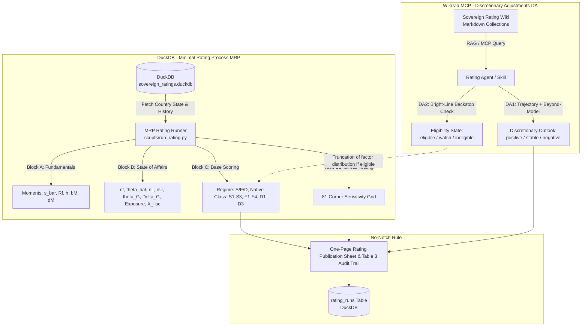

# Sovereign Credit Rating Skill Guide

The **Sovereign Credit Rating Skill** implements the sovereign credit risk methodology specified in *Positioning for Risk-Off: A Methodology for Sovereign Credit Ratings* (Alex Stomper, Humboldt-Universität zu Berlin, August 2026).

---

## 1. Methodology & Theoretical Foundation

Traditional credit rating methodologies score macroeconomic and fiscal fundamentals into heuristic letter grades. In contrast, the **Positioning for Risk-Off** framework recognizes that for market-access sovereigns:
- Default risk is dominated by **where the country sits relative to a fold in its market access** (refinancing capacity band edges), and **how far global risk appetite ($\theta$) would have to move to trigger a bad equilibrium**.
- Sovereign risk is a **correspondence, not a linear function**: inside the fragile region $[n_L, n_U]$, multiple equilibria coexist (good-equilibrium low spread vs. bad-equilibrium distress pricing).
- Positioning is measured in units of a global, estimable state variable: the market price of distress risk $\theta_t$.

### Core Principles

1. **Rate the coordinates, not the price**: Ratings reflect distance to regime exits ($\Delta G, \Delta B$), not transient market spreads.
2. **Global comparable factor units**: Distances $\Delta G$ are denominated in standard deviations of the global factor $\theta$ and convertible into explicit tail default probabilities ($Exposure$).
3. **Transparency means replicability**: Deterministic evaluation from published numbers; no black-box scorecards.
4. **Discretion calibrates inputs or informs outlook; it never moves a score**: Soft information is strictly channeled into input calibration (e.g. DA2 backstop eligibility) or the published outlook (DA1). **There are no rating notches.**

---

## 2. System Architecture & Workflow

The skill coordinates quantitative execution against a local **DuckDB** database with qualitative knowledge retrieval from the **Sovereign Credit Rating Wiki** via **MCP (Model Context Protocol)**.



---

## 3. Mathematical Workflow (MRP Blocks A, B, and C)

### Block A: Fundamentals (The Country's Cliff)
- **Task A1 (Growth Moments)**: $\hat{\mu} = \frac{1}{T}\sum \ln G_t$, $\hat{\sigma}^2 = \frac{1}{T-1}\sum (\ln G_t - \hat{\mu})^2$ over $T=25$ years.
- **Task A2 (Fiscal Capacity $\bar{s}$)**: $\bar{s} = \max_t \frac{1}{5}\sum_{j=t-4}^t pb_j$ (best sustained 5-year average primary balance).
- **Task A3 & A4 (Safe Rate & Haircut)**: 1-year safe gross rate $R^f$ (e.g. $1.02$ for euro area) and baseline haircut $h = 0.30$.
- **Task A5 (Capacity Objects)**:
  $$z_M \text{ solves } \sigma(1 - \Phi(z_M)) = \phi(z_M)$$
  $$\gamma(\theta) = (1 - \Phi(z_M)) e^{\mu - \theta\sigma + \sigma z_M}, \quad b_M(\theta) = \frac{\bar{s}\gamma(\theta)}{R^f - \gamma(\theta)}, \quad d_M(\theta) = (\bar{s} + b_M(\theta)) e^{\mu - \theta\sigma + \sigma z_M}$$
  $$P_\theta(d) = \Phi\left(\frac{\ln d - \ln(\bar{s} + b_M(\theta)) - (\mu - \theta\sigma)}{\sigma}\right)$$

### Block B: State-of-Affairs (The Country's Coordinate)
- **Task B1 (Refinancing Need $n_t$)**:
  $$n_t \approx \frac{d^{stock}_{t-1} - b^{ST}_{t-1}}{M_{t-1}} + b^{ST}_{t-1} + def_t$$
- **Task B3 (Distress Risk Price $\hat{\theta}_t$)**:
  $$z_t = \frac{\ln V_t - m_V}{s_V}, \quad \hat{\theta}_t = \max(0, \theta_\infty + \sigma_\theta z_t), \quad (\theta_\infty, \sigma_\theta) = (0.30, 0.25)$$
- **Task B4 (Band Edges & Regime Classification)**:
  Funding curve $\xi_\theta(d) = \frac{d(1 - h P_\theta(d))}{R^f}$. Stationary points $d_U < d_L$ where $\xi'_\theta(d) = 0$ give:
  $$n_U(\hat{\theta}_t) = \xi(d_U), \quad n_L(\hat{\theta}_t) = \xi(d_L)$$
  - Safe ($S$): $n_t < n_L$
  - Fragile ($F$): $n_L \le n_t \le n_U$
  - Distressed ($D$): $n_t > n_U$
- **Task B5 (Critical Prices, Distances & Exposure)**:
  - $\theta_G(n_t): n_U(\theta_G) = n_t$, $\theta_B(n_t): n_L(\theta_B) = n_t$
  - Exit Distances: $\Delta G = \theta_G - \hat{\theta}_t$, $\Delta B = \hat{\theta}_t - \theta_B$
  - Tail Risk: $Exposure = 1 - \Phi\left(\frac{\theta_G - \theta_\infty}{\sigma_\theta}\right)$
  - Fiscal Exit Time: $X^{fisc} = \frac{\max(n_t - n_L(\theta_\infty), 0)}{\bar{s} - s_t}$

### Block C: Scoring and Rating Classes
| Class | Regime | Condition | Letter Benchmark |
| :--- | :--- | :--- | :--- |
| **S1** | Safe | $Exposure \le 0.01\%$ | AAA / AA+ |
| **S2** | Safe | $Exposure \le 0.1\%$ | AA / A+ |
| **S3** | Safe | $Exposure \le 1.0\%$ | A / BBB+ |
| **F1** | Fragile (G) | $Exposure \le 5\%$ and $X^{fisc} \le 2\text{ years}$ | BBB |
| **F2** | Fragile (G) | $Exposure \le 15\%$ | BB |
| **F3** | Fragile (G) | $Exposure \le 30\%$ | B |
| **F4** | Fragile (G) | $Exposure > 30\%$ | CCC+ |
| **D1** | Distressed | $P[\theta < \theta_B] \ge 25\%$ | CCC |
| **D2** | Distressed | $P[\theta < \theta_B] < 25\%$ | CC / C |
| **D3** | Distressed | $n_t > n_U(\theta)$ across factor 90% range | Imminent SD |

---

## 4. Discretionary Adjustments (DA) via Wiki & MCP

Discretionary tasks are evaluated qualitatively by the LLM querying the Knowledge Wiki:

### Task DA2: Backstop Eligibility State ($e_{it}$)
Evaluates observable bright lines:
1. **`eligible`**: Clean compliance with EU fiscal framework + low-risk Commission DSA classification.
   - *Model Consumer*: Truncates the factor distribution in $Exposure$ at $\theta_G(n_t)$ (bad equilibrium deleted).
2. **`watch`**: Open Excessive Deficit Procedure (EDP) with effective action assessed as taken.
   - *Model Consumer*: No factor truncation; full tail probability calculated.
3. **`ineligible`**: Non-compliance findings or absence of effective action.
   - *Model Consumer*: No truncation; blocks C3 upgrade gate out of distress.

### Task DA1: Discretionary Outlook
Outputs `{positive, stable, negative}` with written rationale based on:
1. **Model-Based Trajectory**: 12-month projected change in $\Delta G$ along the announced $n$-path.
2. **Beyond-Model Information**: Political stability, fiscal coalition risks, banking capitalization vs CRE exposures, demographic cost pressures.

> [!CAUTION]
> **No-Notch Rule**: DA1 Outlook never alters the numerical rating class.

---

## 5. Usage & Execution

### Running the Rating via CLI

```bash
# Execute rating pipeline for Austria
./.venv/bin/python scripts/run_rating.py \
  --country AUT \
  --as-of 2026-08-01 \
  --da2-state watch \
  --outlook negative \
  --outlook-rationale "Projected n-path expansion from deficits + EDP watch state." \
  --save
```

### JSON Mode for Agent Tool Calling

```bash
./.venv/bin/python scripts/run_rating.py --country AUT --as-of 2026-08-01 --json
```

---

## 6. Related Documentation
- [Detailed DuckDB Schema](file:///Users/pkc/Projects/sovereign-credit-rating/docs/duckdb-schema.md)
- [Rating Engine Script & Formulas](file:///Users/pkc/Projects/sovereign-credit-rating/docs/rating-engine-script.md)
