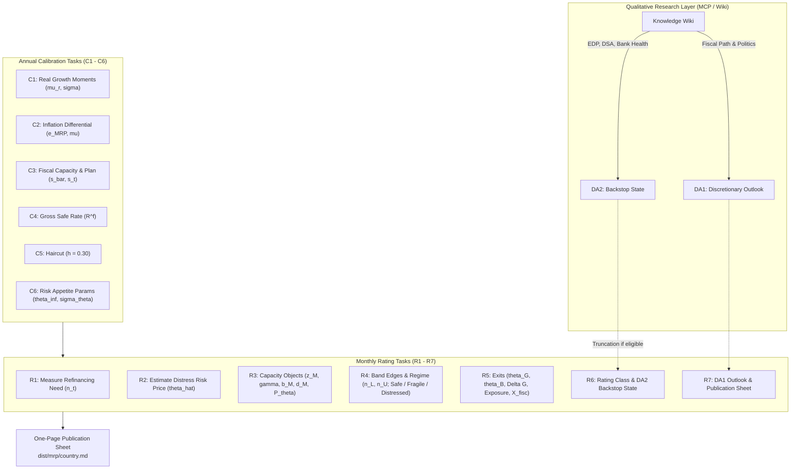

# Minimal Rating Process (MRP v1.0) — Skill & Methodology Guide

The **Sovereign Credit Rating Skill** implements the complete, streamlined procedure specified in *The Minimal Rating Process: Sovereign Credit Ratings from Risk-Off Positioning* (Alex Stomper, Humboldt-Universität zu Berlin, MRP spec v1.0, August 2026).

---

## 1. Methodology & Theoretical Foundation

Traditional credit rating methodologies score macroeconomic and fiscal fundamentals into heuristic letter grades. In contrast, the **Positioning for Risk-Off** framework recognizes that for market-access sovereigns:
- Default risk is dominated by **where the country sits relative to a fold in its market access** (refinancing capacity band edges), and **how far global risk appetite ($\theta$) would have to move to trigger a bad equilibrium**.
- Sovereign risk is a **correspondence, not a linear function**: inside the fragile region $[n_L, n_U]$, multiple equilibria coexist (good-equilibrium low spread vs. bad-equilibrium distress pricing).
- Positioning is measured in units of a single, estimable global state variable: the market price of distress risk $\theta_t$.

### Four Disciplining Principles

1. **Rate the coordinates, not the price**: Ratings reflect the country's coordinate $(n_t, \hat{\theta}_t)$ relative to regime exits ($\Delta G, \Delta B$), not transient market spreads.
2. **Global comparable factor units**: Distances $\Delta G$ are denominated in units of the global factor $\theta$ and converted into explicit tail default probabilities ($\text{Exposure}$).
3. **Replicability**: Deterministic evaluation from published numbers and public code.
4. **Discretion calibrates inputs or warns; it never scores**: Soft information is strictly channeled into calibration tasks or the published outlook (DA1). **The MRP has no rating notches.**

---

## 2. Process Architecture: 6 Calibration Tasks + 7 Rating Tasks

---

## 3. Mathematical Specifications

### Six Annual Calibration Tasks (C1–C6)

- **Task C1 (Real Growth Moments)**:
  $$\hat{\mu}_r = \frac{1}{T}\sum_{t=1}^T g^r_t, \qquad \hat{\sigma}^2 = \frac{1}{T-1}\sum_{t=1}^T \left(g^r_t + \hat{\pi}^d_t - \hat{\mu}_r - \hat{\pi}^d\right)^2 \quad (T = 25\text{ years})$$
- **Task C2 (Inflation: The Differential $e$)**:
  $$e_{\text{MRP}} = \min\{0, \hat{e}_t\}, \qquad \hat{\mu} = \hat{\mu}_r + \hat{\pi}^u + e_{\text{MRP}}$$
  Asymmetric treatment: positive differential is credited with zero; negative differential is debited in full with sensitivity:
  $$\frac{\partial b_M}{\partial e} = \frac{\gamma \bar{s} R^f}{(R^f - \gamma)^2} \quad (\approx 6.3\text{pp of GDP per 100bp})$$
- **Task C3 (Fiscal Capacity $\bar{s}$ and Plan $s_t$)**:
  $$\bar{s} = \max_t \frac{1}{5}\sum_{j=t-4}^t pb_j \quad (\text{demonstrated historical maximum})$$
- **Task C4 (Safe Rate $R^f$)**: 1-year point of ECB AAA yield curve ($R^f = 1 + r$).
- **Task C5 (Haircut $h$)**: Fixed at $h = 0.30$ (Cruces–Trebesch center).
- **Task C6 (Risk-Appetite Parameters)**: Long-run anchor $\theta_\infty = 0.30$, dispersion $\sigma_\theta = 0.25$, 20-year log-VIX history $(m_V, s_V) = (2.70, 0.40)$.

---

### Seven Monthly Rating Tasks (R1–R7)

- **Task R1 (Measure Refinancing Need $n_t$)**:
  $$n_t \approx \frac{d^{stock}_{t-1} - b^{ST}_{t-1}}{M_{t-1}} + b^{ST}_{t-1} + def_t$$
- **Task R2 (Estimate Distress Risk Price $\hat{\theta}_t$)**:
  $$z_t = \frac{\ln V_t - m_V}{s_V}, \qquad \hat{\theta}_t = \max\{0, \theta_\infty + \sigma_\theta z_t\}$$
- **Task R3 (Capacity Objects)**:
  - Solve $\sigma(1 - \Phi(z_M)) = \phi(z_M)$ for unique negative root $z_M$.
  - $\gamma(\hat{\theta}_t) = (1 - \Phi(z_M)) e^{\hat{\mu} - \hat{\theta}_t\sigma + \sigma z_M}$
  - $b_M(\hat{\theta}_t) = \frac{\bar{s} \gamma(\hat{\theta}_t)}{R^f - \gamma(\hat{\theta}_t)}, \qquad d_M(\hat{\theta}_t) = (\bar{s} + b_M(\hat{\theta}_t)) e^{\hat{\mu} - \hat{\theta}_t\sigma + \sigma z_M}$
  - $P_\theta(d) = \Phi\left(\frac{\ln d - \ln(\bar{s} + b_M(\theta)) - (\hat{\mu} - \theta\sigma)}{\sigma}\right)$
- **Task R4 (Band Edges and Regime)**:
  - Stationary points of funding curve $\xi'_\theta(d) = 0 \implies d_U < d_L$, $n_U = \xi(d_U)$, $n_L = \xi(d_L)$.
  - **Safe**: $n_t < n_L$, **Fragile**: $n_L \le n_t \le n_U$, **Distressed**: $n_t > n_U$.
- **Task R5 (Exits & Tail Risk)**:
  - $\theta_G(n_t) : n_U(\theta_G) = n_t, \qquad \theta_B(n_t) : n_L(\theta_B) = n_t$
  - $\Delta G = \theta_G(n_t) - \hat{\theta}_t, \qquad \Delta B = \hat{\theta}_t - \theta_B(n_t)$
  - $\text{Exposure} = 1 - \Phi\left(\frac{\theta_G(n_t) - \theta_\infty}{\sigma_\theta}\right)$
  - $X^{\text{fisc}} = \frac{\max\{n_t - n_L(\theta_\infty), 0\}}{\bar{s} - s_t}$
- **Task R6 (Rating Class & Thresholds)**:
  - **Safe**: S1 ($\le 0.01\%$), S2 ($\le 0.1\%$), S3 ($\le 1\%$).
  - **Fragile ($G$)**: F1 ($\le 5\% \land X^{\text{fisc}} \le 2\text{y}$), F2 ($\le 15\%$), F3 ($\le 30\%$), F4 ($> 30\%$).
  - **Distressed ($B$)**: D1 ($P[\theta < \theta_B] \ge 25\%$), D2 ($< 25\%$), D3 ($n_t > n_U(\theta)$ on 90% range).
  - Letter grade territory: $S1 \approx \text{AAA/AA+}$ down to $D3 \approx \text{imminent SD}$.
- **Task R7 (Outlook & Publication)**:
  - Outlook $\in \{\text{positive}, \text{stable}, \text{negative}\}$ derived from projected $\Delta G$ evolution + qualitative factors.
  - 81-corner sensitivity grid over $\bar{s} \times h \times \hat{\theta}_t \times n_t$.
