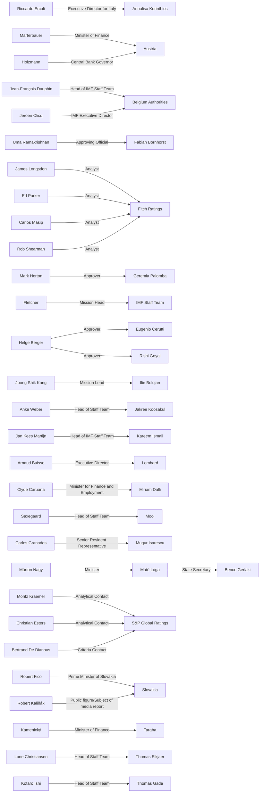

# Visual Social Graph

[[social-graph|← Back to Registry View]]

```mermaid
flowchart LR
    AW["Anke Weber"]
    AK["Annalisa Korinthios"]
    AB["Arnaud Buisse"]
    A["Austria"]
    BA["Belgium Authorities"]
    BG["Bence Gerlaki"]
    BDD["Bertrand De Dianous"]
    CG["Carlos Granados"]
    CM["Carlos Masip"]
    CE["Christian Esters"]
    CC["Clyde Caruana"]
    EP["Ed Parker"]
    EC["Eugenio Cerutti"]
    FB["Fabian Bornhorst"]
    FR["Fitch Ratings"]
    F["Fletcher"]
    GP["Geremia Palomba"]
    HB["Helge Berger"]
    H["Holzmann"]
    IST["IMF Staff Team"]
    IB["Ilie Bolojan"]
    JK["Jakree Koosakul"]
    JL["James Longsdon"]
    JKM["Jan Kees Martijn"]
    JFD["Jean-François Dauphin"]
    JC["Jeroen Clicq"]
    JSK["Joong Shik Kang"]
    K["Kamenický"]
    KI["Kareem Ismail"]
    KI1["Kotaro Ishi"]
    L["Lombard"]
    LC["Lone Christiansen"]
    MH["Mark Horton"]
    M["Marterbauer"]
    MD["Miriam Dalli"]
    M1["Mooi"]
    MK["Moritz Kraemer"]
    MI["Mugur Isarescu"]
    MN["Márton Nagy"]
    ML["Máté Lóga"]
    RE["Riccardo Ercoli"]
    RG["Rishi Goyal"]
    RS["Rob Shearman"]
    RF["Robert Fico"]
    RK["Robert Kaliňák"]
    SGR["S&P Global Ratings"]
    S["Saxegaard"]
    S1["Slovakia"]
    T["Taraba"]
    TE["Thomas Elkjaer"]
    TG["Thomas Gade"]
    UR["Uma Ramakrishnan"]
    RF -- "Prime Minister of Slovakia" --> S1
    RK -- "Public figure/Subject of media report" --> S1
    JL -- "Analyst" --> FR
    EP -- "Analyst" --> FR
    CM -- "Analyst" --> FR
    RS -- "Analyst" --> FR
    MH -- "Approver" --> GP
    KI1 -- "Head of Staff Team" --> TG
    CC -- "Minister for Finance and Employment" --> MD
    M -- "Minister of Finance" --> A
    H -- "Central Bank Governor" --> A
    F -- "Mission Head" --> IST
    JFD -- "Head of IMF Staff Team" --> BA
    JC -- "IMF Executive Director" --> BA
    HB -- "Approver" --> EC
    AB -- "Executive Director" --> L
    AW -- "Head of Staff Team" --> JK
    MN -- "Minister" --> ML
    ML -- "State Secretary" --> BG
    HB -- "Approver" --> RG
    LC -- "Head of Staff Team" --> TE
    RE -- "Executive Director for Italy" --> AK
    JSK -- "Mission Lead" --> IB
    CG -- "Senior Resident Representative" --> MI
    S -- "Head of Staff Team" --> M1
    K -- "Minister of Finance" --> T
    JKM -- "Head of IMF Staff Team" --> KI
    UR -- "Approving Official" --> FB
    MK -- "Analytical Contact" --> SGR
    CE -- "Analytical Contact" --> SGR
    BDD -- "Criteria Contact" --> SGR
```

