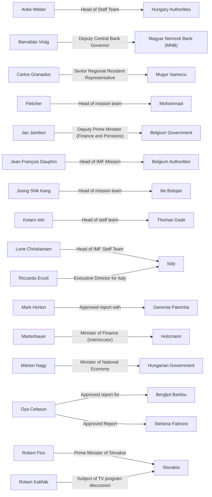

# Social Graph

## Connection Map

## Relationship Registry

| Person A | Connection | Person B | Context / Source |
| :--- | :--- | :--- | :--- |
| [[Robert Fico]] | Prime Minister of Slovakia | [[Slovakia]] | [[2025 Rule of Law Report: Slovakia]] |
| [[Robert Kaliňák]] | Subject of TV program discussion | [[Slovakia]] | [[2025 Rule of Law Report: Slovakia]] |
| [[Oya Celasun]] | Approved report for | [[Bergljot Barkbu]] | [[IMF 2025 Article IV Consultation - Austria]] |
| [[Fletcher]] | Head of mission team | [[Mohommad]] | [[IMF 2025 Article IV Consultation - Austria]] |
| [[Marterbauer]] | Minister of Finance (Interlocutor) | [[Holzmann]] | [[IMF 2025 Article IV Consultation - Austria]] |
| [[Jean-François Dauphin]] | Head of IMF Mission | [[Belgium Authorities]] | [[IMF 2025 Article IV Consultation - Belgium]] |
| [[Jan Jambon]] | Deputy Prime Minister (Finance and Pensions) | [[Belgium Government]] | [[IMF 2025 Article IV Consultation - Belgium]] |
| [[Anke Weber]] | Head of Staff Team | [[Hungary Authorities]] | [[IMF 2025 Article IV Consultation - Hungary]] |
| [[Márton Nagy]] | Minister of National Economy | [[Hungarian Government]] | [[IMF 2025 Article IV Consultation - Hungary]] |
| [[Barnabás Virág]] | Deputy Central Bank Governor | [[Magyar Nemzeti Bank (MNB)]] | [[IMF 2025 Article IV Consultation - Hungary]] |
| [[Lone Christiansen]] | Head of IMF Staff Team | [[Italy]] | [[IMF 2025 Article IV Consultation - Italy]] |
| [[Riccardo Ercoli]] | Executive Director for Italy | [[Italy]] | [[IMF 2025 Article IV Consultation - Italy]] |
| [[Joong Shik Kang]] | Head of mission team | [[Ilie Bolojan]] | [[IMF 2025 Article IV Consultation - Romania]] |
| [[Carlos Granados]] | Senior Regional Resident Representative | [[Mugur Isarescu]] | [[IMF 2025 Article IV Consultation - Romania]] |
| [[Oya Celasun]] | Approved Report | [[Stefania Fabrizio]] | [[IMF 2025 Article IV Consultation - Slovak Republic]] |
| [[Mark Horton]] | Approved report with | [[Geremia Palomba]] | [[IMF 2025 Malta Country Report - Article IV Consultation]] |
| [[Kotaro Ishi]] | Head of staff team | [[Thomas Gade]] | [[IMF 2025 Malta Country Report - Article IV Consultation]] |
