# Visual Timeline

[[timeline|← Back to List View]]

```mermaid
%%{init: {
  "themeVariables": {
    "cScale0": "#6B75CC", "cScaleLabel0": "#0f172a",
    "cScale1": "#6B75CC", "cScaleLabel1": "#0f172a",
    "cScale2": "#6B75CC", "cScaleLabel2": "#0f172a",
    "cScale3": "#6B75CC", "cScaleLabel3": "#0f172a",
    "cScale4": "#6B75CC", "cScaleLabel4": "#0f172a",
    "cScale5": "#6B75CC", "cScaleLabel5": "#0f172a",
    "cScale6": "#6B75CC", "cScaleLabel6": "#0f172a",
    "cScale7": "#6B75CC", "cScaleLabel7": "#0f172a",
    "cScale8": "#6B75CC", "cScaleLabel8": "#0f172a",
    "cScale9": "#6B75CC", "cScaleLabel9": "#0f172a",
    "cScale10": "#6B75CC", "cScaleLabel10": "#0f172a",
    "cScale11": "#6B75CC", "cScaleLabel11": "#0f172a"
  }
}}%%
timeline
    title Timeline
    2023 : 2023-07 — European Council Initiates Excessive Deficit Procedure Against Slovakia : 2023-11-20 — Adoption of the Law Reforming the Status of Magistrates
    2024 : 2024 — Establishment of Science Malta #40;Xjenza Malta#41; : 2024 — Fiscal deficit widened to 4.7% of GDP : 2024 — Introduction of new agency regulation and skills pass for non-EU nationals : 2024 — Paris Olympics Impact on GDP : 2024 — Polish GDP growth of 2.9% : 2024 — Successive year of recession #40;Real GDP fell by 1.3%#41; : 2024-03 — Adoption of Justice System Reform by the Government : 2024-06 — June 2024 Elections : 2024-06-2024 — Government Proposal for National Human Rights Institutions Accreditation : 2024-07 — Adoption of federal law amending administrative transparency framework : 2024-07 — Amendments to stabilising expenditure rule : 2024-08-06 — Introduction of lenient sanctions and shortened statutes of limitations for corruption : 2024-09 — Completion of the transfer of non-summary case prosecutions to the Attorney General : 2024-09 — European Court of Justice Rules Against Hungarian Agricultural Price Fixing : 2024-09-19 — Constitutional Court annuls subsidy provision excluding certain organizations : 2024-09-25 — High Council for the Judiciary approves directive on out-of-tenure appointments for magistrates : 2024-10 — Change of Government in Slovakia : 2024-10-17 — IMF Staff Mission Concludes Discussions in Warsaw : 2024-10-22 — European Court of Human Rights judgment on the Immigration Appeals Board : 2024-11 — Hungary Submits Medium-Term Fiscal-Structural Plan to European Commission : 2024-11-04 — IMF Staff Mission Begins in Valletta : 2024-11-13 — High Council for the Judiciary approves directive regarding appraisal of magistrates’ performance : 2024-11-14 — Constitutional Court restricts recourse to urgent court orders challenging strikes : 2024-11-15 — IMF-Malta Policy Discussions Conclude : 2024-11-2024 — First Round of Presidential Elections : 2024-11-28 — High Council for Justice supplementary report on the Court of Appeal of Brussels backlogs : 2024-11-29 — Submission of Parliamentary Bill on Corporate Governance in Companies with State Treasury Shareholding : 2024-12 — Adoption of additional amendments to align with PIF Directive : 2024-12 — Adoption of Fourteenth Amendment to the Fundamental Law : 2024-12 — Court of Audit report on digitalization strategy shortcomings : 2024-12 — Enactment of legislation establishing a Fiscal Council : 2024-12 — Fall of Prime Minister Barnier's Government : 2024-12 — Hungary Submits Addendum to Medium-Term Fiscal-Structural Plan : 2024-12 — Moody's Downgrade of France's Credit Rating to Aa3 : 2024-12-03 — High Council for the Judiciary approves Code of Judicial Management : 2024-12-06 — Adoption of Draft Law Separating Minister of Justice and Prosecutor General Functions : 2024-12-06 — Constitutional Court Decision Annulling First Round of Presidential Elections : 2024-12-16 — IMF Staff Report Completion Date : 2024-12-17 — IMF Staff Report Completion : 2024-12-18 — Addition of TVN and Polsat to List of Strategic Companies Requiring Government Approval for Sale : 2024-12-27 — Adoption of law protecting whistleblowers in the House of Representatives and Senate
    2025 : 2025 — Publication of the 2025 Country Report Belgium by the European Commission : 2025-01 — Council initiates excessive deficit procedure for Poland : 2025-01 — Entry into Force of Amendments to the Data Protection Act : 2025-01 — Expiration of electricity price caps causing headline inflation spike : 2025-01 — National Anti-Corruption Authority #40;ANAC#41; approves update to the National Anti-Corruption Plan : 2025-01 — Publication of Draft Law Implementing Anti-SLAPP Directive : 2025-01-01 — Entry into Force of Revised Legislative Consultation and Impact Assessment Rules : 2025-01-01 — Extension of Compulsory Online Publication of Judgments to Higher Regional Courts : 2025-01-01 — Implementation of Criminal Procedure Law Amendments to Increase Efficiency : 2025-01-08 — High Council for the Judiciary issues critical opinion on the separation of judges and prosecutors : 2025-01-10 — IMF Executive Board Discussion : 2025-01-15 — IMF Executive Board Concludes Article IV Consultation : 2025-01-16 — Chamber of Deputies approves draft constitutional reform separating careers of judges and prosecutors : 2025-01-2025 — Adoption of Strategy for Open Government 2025-2030 : 2025-01-21 — Council Recommendation endorsing Malta's medium-term fiscal-structural plan : 2025-01-21 — Council Recommendation to correct the excessive deficit in Malta : 2025-01-21 — IMF Executive Board Concludes Article IV Consultation : 2025-01-25 — Revision of rules on mediation and assisted negotiation comes into force : 2025-01-28 — End of IMF Staff Discussions with Slovak Republic Officials : 2025-01-31 — European Public Prosecutor Office Becomes Fully Operational in Poland : 2025-02 — Approval of 2025 French Budget : 2025-02 — End of caretaker government and formation of new federal government : 2025-02 — Formation of New Federal Government : 2025-02-25 — National Audiovisual Council Decision on Electoral Campaigns : 2025-03 — Amendments to Freedom of Information Act coming into force : 2025-03 — Government Action Plan for Public Finance Monitoring : 2025-03 — Government agreement signed for 2025-2029 term : 2025-03 — Government Introduces 10% Retailer Profit Margin Cap for Food Products : 2025-03 — Implementation of new judicial appointment criteria and retirement age extensions : 2025-03 — New coalition government formed #40;ÖVP, SPÖ, NEOS#41; : 2025-03 — Presentation of the New Government Programme Committing to Judicial Reforms : 2025-03 — Update of Civic Space Rating from 'Obstructed' to 'Narrowed' : 2025-03-03 — Completion of IMF Staff Report : 2025-03-05 — National Association of Magistrates presents document with eight proposals on administration of justice : 2025-03-14 — Entry into Force of New Whistleblower Protection Law : 2025-03-18 — Conclusion of 2025 Article IV Consultation : 2025-03-2025 — Adoption of Law on Conflicts of Interest and Gifts : 2025-03-2025 — Surveillance of Investigative Journalist by National Anti-Corruption Directorate : 2025-03-24 — IMF Executive Board Concludes 2025 Article IV Consultation with Slovak Republic : 2025-03-31 — Superior Council of the Magistracy Defense of Judicial Independence : 2025-04 — Entry into force of the Government Decree later converted into Security Law : 2025-04 — European Commission 2025 Spring Forecast Published : 2025-04 — Parliament approval of Bill No. 125 reforming magisterial inquiries : 2025-04-01 — Introduction of Increased Court Fees #40;Approx. 23%#41; : 2025-04-08 — IMF Article IV discussions concluded with Austrian officials : 2025-04-13 — Government tabled comprehensive constitutional reform regarding the justice sector in Parliament : 2025-04-16 — Adoption of law amending NGOs' functioning #40;reporting obligations#41; : 2025-04-21 — Proposal of Draft Law to Dismantle Supreme Court Chamber of Extraordinary Control and Public Affairs : 2025-04-24 — Proposal of Draft Law on Judges Appointed by Post-2017 National Council for the Judiciary : 2025-04-29 — European Court of Justice ruling that Malta's investor citizenship scheme is contrary to EU Law : 2025-04-30 — Deadline for reforms and investments underpinning the extension of the fiscal adjustment period : 2025-04-30 — Hungary Requests Activation of National Escape Clause for Defence Spending : 2025-05 — Constitutional Court declares law abrogating abuse of office compliant with the Constitution : 2025-05 — Government Introduces 15% Margin Cap for Personal Hygiene and Cleaning Products : 2025-05 — Romanian Presidential Elections : 2025-05-05 — Cut-off date for data used to prepare the Country Report : 2025-05-06 — Hungary Submits 2026 Budget Law to Parliament : 2025-05-12 — Start of IMF Staff Mission in Paris : 2025-05-13 — Publication of Flash Missions Reports on Justice Efficiency : 2025-05-18 — Council Recommendation Endorsing Hungary's Medium-Term Fiscal-Structural Plan : 2025-05-2025 — Repeat of Presidential Election First Round : 2025-05-22 — Conclusion of IMF Staff Mission Discussions in Paris : 2025-05-28 — Conclusion of Policy Discussions with Italian Authorities : 2025-06 — Adoption of Act XLIX of 2025 strengthening Kúria's role and court compensation schemes : 2025-06 — Election of new Prosecutor General following Fifteenth Amendment : 2025-06 — New Coalition Government Formation : 2025-06 — Parliamentary Committee for the Security of the Republic #40;COPASIR#41; publishes report on spyware use : 2025-06 — Passage of law removing cap on political campaign expenses : 2025-06 — Planned New Appointments to ORF Management Bodies Following Constitutional Ruling : 2025-06-04 — EU Commission 2025 Country Report Austria Publication : 2025-06-04 — Parliament adopts the Security Law by converting the Government Decree : 2025-06-04 — Publication of 2025 Country Report - Malta : 2025-06-04 — Publication of 2025 Country Report - Poland : 2025-06-06 — Venice Commission Report on Presidential Election Invalidation : 2025-06-09 — IMF Staff Report completed : 2025-06-17 — IMF Staff Mission Concludes Discussions in Budapest : 2025-06-17 — Update on Pending European Court of Human Rights Judgments : 2025-06-23 — High Court of Cassation issues periodic report on legislative measures including Security Law : 2025-06-25 — Completion of IMF Staff Report : 2025-06-29 — Constitutional Court Decision on Asset Declaration Unconstitutionality : 2025-06-30 — Scheduled Debate on Public Broadcasting Holding Company Reform : 2025-07 — Adoption of Large Fiscal Reform Package : 2025-07 — Entry into force of Act on Slovak Television and Radio #40;STVR#41; : 2025-07 — Expiration of borrower-based macroprudential measures #40;KIM-V regulation#41; for residential real estate : 2025-07 — Final Report of the Investigative Commission on Political Influence in Judiciary : 2025-07 — Implementation of Sectoral Systemic Risk Buffer #40;SSyRB#41; for Commercial Real Estate : 2025-07-01 — IMF Staff Report Completion for 2025 Article IV Consultation : 2025-07-03 — IMF Executive Board concludes Article IV Consultation with Austria : 2025-07-05 — Decree Digitalizing and Simplifying CSO Procedures : 2025-07-08 — Publication of 2025 Rule of Law Report Country Chapter on Romania : 2025-07-08 — Publication of 2025 Rule of Law Report Country Chapter on Slovakia : 2025-07-08 — Publication of 2025 Rule of Law Report Poland Chapter : 2025-07-08 — Publication of the 2025 Rule of Law Report Country Chapter on Austria : 2025-07-08 — Publication of the 2025 Rule of Law Report Country Chapter on Belgium : 2025-07-08 — Publication of the 2025 Rule of Law Report Country Chapter on Malta : 2025-07-08 — Publication of the 2025 Rule of Law Report -  Country Chapter on Italy : 2025-07-08 — Publication of the 2025 Rule of Law Report -  France : 2025-07-11 — IMF Executive Board Discussion of Staff Report : 2025-07-14 — IMF Executive Board Concludes 2025 Article IV Consultation with France : 2025-07-18 — IMF Executive Board Concludes 2025 Article IV Consultation with Italy : 2025-07-25 — IMF Staff Report Completion for 2025 Article IV Consultation : 2025-08 — Law abrogating the offence of abuse of public office enters into force : 2025-08 — VAT Rate Hike and Excise Increases Implementation : 2025-08-29 — IMF Executive Board Concludes 2025 Article IV Consultation with Hungary : 2025-09 — IMF Staff Mission Discussions #40;September 3–12#41; : 2025-10 — Constitutional Court Ruling on Unconstitutional Restriction of Legal Aid : 2025-11 — Extension of 'state of danger' until November 2025 : 2025-11 — IMF Executive Board Concludes Article IV Consultation : 2025-Q4 — Expected entry into force of the draft law on the simplification of economic life
```

<input type="text" id="graph-search" placeholder="Search timeline events..." autocomplete="off"><button id="search-clear" class="search-clear-btn" type="button">&times;</button>

<label for="timeline-tag-threshold">Min. tags:</label><select id="timeline-tag-threshold" class="filter-dropdown-select"><option value="0">At least 0 tags</option></select>

<div id="timeline-data" data-events="%5B%7B%22date%22%3A%222023-07%22%2C%22title%22%3A%22European%20Council%20Initiates%20Excessive%20Deficit%20Procedure%20Against%20Slovakia%22%2C%22source%22%3A%22IMF%202025%20Slovakia%20Country%20Report%22%2C%22tagCount%22%3A7%7D%2C%7B%22date%22%3A%222023-11-20%22%2C%22title%22%3A%22Adoption%20of%20the%20Law%20Reforming%20the%20Status%20of%20Magistrates%22%2C%22source%22%3A%222025%20Rule%20of%20Law%20Report%3A%20France%20Country%20Chapter%22%2C%22tagCount%22%3A7%7D%2C%7B%22date%22%3A%222024%22%2C%22title%22%3A%22Establishment%20of%20Science%20Malta%20(Xjenza%20Malta)%22%2C%22source%22%3A%222025%20Country%20Report%20Malta%22%2C%22tagCount%22%3A4%7D%2C%7B%22date%22%3A%222024%22%2C%22title%22%3A%22Fiscal%20deficit%20widened%20to%204.7%25%20of%20GDP%22%2C%22source%22%3A%22IMF%202025%20Austria%20Country%20Report%22%2C%22tagCount%22%3A6%7D%2C%7B%22date%22%3A%222024%22%2C%22title%22%3A%22Introduction%20of%20new%20agency%20regulation%20and%20skills%20pass%20for%20non-EU%20nationals%22%2C%22source%22%3A%222025%20Country%20Report%20Malta%22%2C%22tagCount%22%3A4%7D%2C%7B%22date%22%3A%222024%22%2C%22title%22%3A%22Paris%20Olympics%20Impact%20on%20GDP%22%2C%22source%22%3A%22France%202025%20Article%20IV%20Consultation%3A%20Press%20Release%2C%20Staff%20Report%2C%20and%20Executive%20Director%20Statement%22%2C%22tagCount%22%3A7%7D%2C%7B%22date%22%3A%222024%22%2C%22title%22%3A%22Polish%20GDP%20growth%20of%202.9%25%22%2C%22source%22%3A%222025%20Country%20Report%20Poland%22%2C%22tagCount%22%3A5%7D%2C%7B%22date%22%3A%222024%22%2C%22title%22%3A%22Successive%20year%20of%20recession%20(Real%20GDP%20fell%20by%201.3%25)%22%2C%22source%22%3A%22IMF%202025%20Austria%20Country%20Report%22%2C%22tagCount%22%3A6%7D%2C%7B%22date%22%3A%222024-03%22%2C%22title%22%3A%22Adoption%20of%20Justice%20System%20Reform%20by%20the%20Government%22%2C%22source%22%3A%222025%20Rule%20of%20Law%20Report%20Italy%22%2C%22tagCount%22%3A7%7D%2C%7B%22date%22%3A%222024-06%22%2C%22title%22%3A%22June%202024%20Elections%22%2C%22source%22%3A%22Belgium%202025%20Article%20IV%20Consultation%22%2C%22tagCount%22%3A5%7D%2C%7B%22date%22%3A%222024-06-2024%22%2C%22title%22%3A%22Government%20Proposal%20for%20National%20Human%20Rights%20Institutions%20Accreditation%22%2C%22source%22%3A%222025%20Rule%20of%20Law%20Report%20Romania%22%2C%22tagCount%22%3A7%7D%2C%7B%22date%22%3A%222024-07%22%2C%22title%22%3A%22Adoption%20of%20federal%20law%20amending%20administrative%20transparency%20framework%22%2C%22source%22%3A%222025%20Rule%20of%20Law%20Report%20Belgium%22%2C%22tagCount%22%3A7%7D%2C%7B%22date%22%3A%222024-07%22%2C%22title%22%3A%22Amendments%20to%20stabilising%20expenditure%20rule%22%2C%22source%22%3A%222025%20Country%20Report%20Poland%22%2C%22tagCount%22%3A5%7D%2C%7B%22date%22%3A%222024-08-06%22%2C%22title%22%3A%22Introduction%20of%20lenient%20sanctions%20and%20shortened%20statutes%20of%20limitations%20for%20corruption%22%2C%22source%22%3A%222025%20Rule%20of%20Law%20Report%20Slovakia%20Country%20Chapter%22%2C%22tagCount%22%3A8%7D%2C%7B%22date%22%3A%222024-09%22%2C%22title%22%3A%22Completion%20of%20the%20transfer%20of%20non-summary%20case%20prosecutions%20to%20the%20Attorney%20General%22%2C%22source%22%3A%222025%20Rule%20of%20Law%20Report%20Malta%22%2C%22tagCount%22%3A7%7D%2C%7B%22date%22%3A%222024-09%22%2C%22title%22%3A%22European%20Court%20of%20Justice%20Rules%20Against%20Hungarian%20Agricultural%20Price%20Fixing%22%2C%22source%22%3A%222025%20Country%20Report%20Hungary%22%2C%22tagCount%22%3A10%7D%2C%7B%22date%22%3A%222024-09-19%22%2C%22title%22%3A%22Constitutional%20Court%20annuls%20subsidy%20provision%20excluding%20certain%20organizations%22%2C%22source%22%3A%222025%20Rule%20of%20Law%20Report%20Belgium%22%2C%22tagCount%22%3A7%7D%2C%7B%22date%22%3A%222024-09-25%22%2C%22title%22%3A%22High%20Council%20for%20the%20Judiciary%20approves%20directive%20on%20out-of-tenure%20appointments%20for%20magistrates%22%2C%22source%22%3A%222025%20Rule%20of%20Law%20Report%20Italy%22%2C%22tagCount%22%3A7%7D%2C%7B%22date%22%3A%222024-10%22%2C%22title%22%3A%22Change%20of%20Government%20in%20Slovakia%22%2C%22source%22%3A%22IMF%202025%20Slovakia%20Country%20Report%22%2C%22tagCount%22%3A7%7D%2C%7B%22date%22%3A%222024-10-17%22%2C%22title%22%3A%22IMF%20Staff%20Mission%20Concludes%20Discussions%20in%20Warsaw%22%2C%22source%22%3A%222024%20Article%20IV%20Consultation%20with%20the%20Republic%20of%20Poland%22%2C%22tagCount%22%3A8%7D%2C%7B%22date%22%3A%222024-10-22%22%2C%22title%22%3A%22European%20Court%20of%20Human%20Rights%20judgment%20on%20the%20Immigration%20Appeals%20Board%22%2C%22source%22%3A%222025%20Rule%20of%20Law%20Report%20Malta%22%2C%22tagCount%22%3A7%7D%2C%7B%22date%22%3A%222024-11%22%2C%22title%22%3A%22Hungary%20Submits%20Medium-Term%20Fiscal-Structural%20Plan%20to%20European%20Commission%22%2C%22source%22%3A%222025%20Country%20Report%20Hungary%22%2C%22tagCount%22%3A10%7D%2C%7B%22date%22%3A%222024-11-04%22%2C%22title%22%3A%22IMF%20Staff%20Mission%20Begins%20in%20Valletta%22%2C%22source%22%3A%22Malta%202024%20Article%20IV%20Consultation%20Staff%20Report%20and%20Press%20Release%22%2C%22tagCount%22%3A6%7D%2C%7B%22date%22%3A%222024-11-13%22%2C%22title%22%3A%22High%20Council%20for%20the%20Judiciary%20approves%20directive%20regarding%20appraisal%20of%20magistrates%E2%80%99%20performance%22%2C%22source%22%3A%222025%20Rule%20of%20Law%20Report%20Italy%22%2C%22tagCount%22%3A7%7D%2C%7B%22date%22%3A%222024-11-14%22%2C%22title%22%3A%22Constitutional%20Court%20restricts%20recourse%20to%20urgent%20court%20orders%20challenging%20strikes%22%2C%22source%22%3A%222025%20Rule%20of%20Law%20Report%20Belgium%22%2C%22tagCount%22%3A7%7D%2C%7B%22date%22%3A%222024-11-15%22%2C%22title%22%3A%22IMF-Malta%20Policy%20Discussions%20Conclude%22%2C%22source%22%3A%22Malta%202024%20Article%20IV%20Consultation%20Staff%20Report%20and%20Press%20Release%22%2C%22tagCount%22%3A6%7D%2C%7B%22date%22%3A%222024-11-2024%22%2C%22title%22%3A%22First%20Round%20of%20Presidential%20Elections%22%2C%22source%22%3A%222025%20Rule%20of%20Law%20Report%20Romania%22%2C%22tagCount%22%3A7%7D%2C%7B%22date%22%3A%222024-11-28%22%2C%22title%22%3A%22High%20Council%20for%20Justice%20supplementary%20report%20on%20the%20Court%20of%20Appeal%20of%20Brussels%20backlogs%22%2C%22source%22%3A%222025%20Rule%20of%20Law%20Report%20Belgium%22%2C%22tagCount%22%3A7%7D%2C%7B%22date%22%3A%222024-11-29%22%2C%22title%22%3A%22Submission%20of%20Parliamentary%20Bill%20on%20Corporate%20Governance%20in%20Companies%20with%20State%20Treasury%20Shareholding%22%2C%22source%22%3A%222025%20Rule%20of%20Law%20Report%20Poland%22%2C%22tagCount%22%3A7%7D%2C%7B%22date%22%3A%222024-12%22%2C%22title%22%3A%22Adoption%20of%20additional%20amendments%20to%20align%20with%20PIF%20Directive%22%2C%22source%22%3A%222025%20Rule%20of%20Law%20Report%20Slovakia%20Country%20Chapter%22%2C%22tagCount%22%3A8%7D%2C%7B%22date%22%3A%222024-12%22%2C%22title%22%3A%22Adoption%20of%20Fourteenth%20Amendment%20to%20the%20Fundamental%20Law%22%2C%22source%22%3A%222025%20Rule%20of%20Law%20Report%20Hungary%22%2C%22tagCount%22%3A7%7D%2C%7B%22date%22%3A%222024-12%22%2C%22title%22%3A%22Court%20of%20Audit%20report%20on%20digitalization%20strategy%20shortcomings%22%2C%22source%22%3A%222025%20Rule%20of%20Law%20Report%20Belgium%22%2C%22tagCount%22%3A7%7D%2C%7B%22date%22%3A%222024-12%22%2C%22title%22%3A%22Enactment%20of%20legislation%20establishing%20a%20Fiscal%20Council%22%2C%22source%22%3A%222025%20Country%20Report%20Poland%22%2C%22tagCount%22%3A5%7D%2C%7B%22date%22%3A%222024-12%22%2C%22title%22%3A%22Fall%20of%20Prime%20Minister%20Barnier's%20Government%22%2C%22source%22%3A%22France%202025%20Article%20IV%20Consultation%3A%20Press%20Release%2C%20Staff%20Report%2C%20and%20Executive%20Director%20Statement%22%2C%22tagCount%22%3A7%7D%2C%7B%22date%22%3A%222024-12%22%2C%22title%22%3A%22Hungary%20Submits%20Addendum%20to%20Medium-Term%20Fiscal-Structural%20Plan%22%2C%22source%22%3A%222025%20Country%20Report%20Hungary%22%2C%22tagCount%22%3A10%7D%2C%7B%22date%22%3A%222024-12%22%2C%22title%22%3A%22Moody's%20Downgrade%20of%20France's%20Credit%20Rating%20to%20Aa3%22%2C%22source%22%3A%22France%202025%20Article%20IV%20Consultation%3A%20Press%20Release%2C%20Staff%20Report%2C%20and%20Executive%20Director%20Statement%22%2C%22tagCount%22%3A7%7D%2C%7B%22date%22%3A%222024-12-03%22%2C%22title%22%3A%22High%20Council%20for%20the%20Judiciary%20approves%20Code%20of%20Judicial%20Management%22%2C%22source%22%3A%222025%20Rule%20of%20Law%20Report%20Italy%22%2C%22tagCount%22%3A7%7D%2C%7B%22date%22%3A%222024-12-06%22%2C%22title%22%3A%22Adoption%20of%20Draft%20Law%20Separating%20Minister%20of%20Justice%20and%20Prosecutor%20General%20Functions%22%2C%22source%22%3A%222025%20Rule%20of%20Law%20Report%20Poland%22%2C%22tagCount%22%3A7%7D%2C%7B%22date%22%3A%222024-12-06%22%2C%22title%22%3A%22Constitutional%20Court%20Decision%20Annulling%20First%20Round%20of%20Presidential%20Elections%22%2C%22source%22%3A%222025%20Rule%20of%20Law%20Report%20Romania%22%2C%22tagCount%22%3A7%7D%2C%7B%22date%22%3A%222024-12-16%22%2C%22title%22%3A%22IMF%20Staff%20Report%20Completion%20Date%22%2C%22source%22%3A%222024%20Article%20IV%20Consultation%20with%20the%20Republic%20of%20Poland%22%2C%22tagCount%22%3A8%7D%2C%7B%22date%22%3A%222024-12-17%22%2C%22title%22%3A%22IMF%20Staff%20Report%20Completion%22%2C%22source%22%3A%22Malta%202024%20Article%20IV%20Consultation%20Staff%20Report%20and%20Press%20Release%22%2C%22tagCount%22%3A6%7D%2C%7B%22date%22%3A%222024-12-18%22%2C%22title%22%3A%22Addition%20of%20TVN%20and%20Polsat%20to%20List%20of%20Strategic%20Companies%20Requiring%20Government%20Approval%20for%20Sale%22%2C%22source%22%3A%222025%20Rule%20of%20Law%20Report%20Poland%22%2C%22tagCount%22%3A7%7D%2C%7B%22date%22%3A%222024-12-27%22%2C%22title%22%3A%22Adoption%20of%20law%20protecting%20whistleblowers%20in%20the%20House%20of%20Representatives%20and%20Senate%22%2C%22source%22%3A%222025%20Rule%20of%20Law%20Report%20Belgium%22%2C%22tagCount%22%3A7%7D%2C%7B%22date%22%3A%222025%22%2C%22title%22%3A%22Publication%20of%20the%202025%20Country%20Report%20Belgium%20by%20the%20European%20Commission%22%2C%22source%22%3A%222025%20Country%20Report%20Belgium%22%2C%22tagCount%22%3A5%7D%2C%7B%22date%22%3A%222025-01%22%2C%22title%22%3A%22Council%20initiates%20excessive%20deficit%20procedure%20for%20Poland%22%2C%22source%22%3A%222025%20Country%20Report%20Poland%22%2C%22tagCount%22%3A5%7D%2C%7B%22date%22%3A%222025-01%22%2C%22title%22%3A%22Entry%20into%20Force%20of%20Amendments%20to%20the%20Data%20Protection%20Act%22%2C%22source%22%3A%222025%20Rule%20of%20Law%20Report%20Austria%22%2C%22tagCount%22%3A5%7D%2C%7B%22date%22%3A%222025-01%22%2C%22title%22%3A%22Expiration%20of%20electricity%20price%20caps%20causing%20headline%20inflation%20spike%22%2C%22source%22%3A%22IMF%202025%20Austria%20Country%20Report%22%2C%22tagCount%22%3A6%7D%2C%7B%22date%22%3A%222025-01%22%2C%22title%22%3A%22National%20Anti-Corruption%20Authority%20(ANAC)%20approves%20update%20to%20the%20National%20Anti-Corruption%20Plan%22%2C%22source%22%3A%222025%20Rule%20of%20Law%20Report%20Italy%22%2C%22tagCount%22%3A7%7D%2C%7B%22date%22%3A%222025-01%22%2C%22title%22%3A%22Publication%20of%20Draft%20Law%20Implementing%20Anti-SLAPP%20Directive%22%2C%22source%22%3A%222025%20Rule%20of%20Law%20Report%20Poland%22%2C%22tagCount%22%3A7%7D%2C%7B%22date%22%3A%222025-01-01%22%2C%22title%22%3A%22Entry%20into%20Force%20of%20Revised%20Legislative%20Consultation%20and%20Impact%20Assessment%20Rules%22%2C%22source%22%3A%222025%20Rule%20of%20Law%20Report%20Poland%22%2C%22tagCount%22%3A7%7D%2C%7B%22date%22%3A%222025-01-01%22%2C%22title%22%3A%22Extension%20of%20Compulsory%20Online%20Publication%20of%20Judgments%20to%20Higher%20Regional%20Courts%22%2C%22source%22%3A%222025%20Rule%20of%20Law%20Report%20Austria%22%2C%22tagCount%22%3A5%7D%2C%7B%22date%22%3A%222025-01-01%22%2C%22title%22%3A%22Implementation%20of%20Criminal%20Procedure%20Law%20Amendments%20to%20Increase%20Efficiency%22%2C%22source%22%3A%222025%20Rule%20of%20Law%20Report%20Austria%22%2C%22tagCount%22%3A5%7D%2C%7B%22date%22%3A%222025-01-08%22%2C%22title%22%3A%22High%20Council%20for%20the%20Judiciary%20issues%20critical%20opinion%20on%20the%20separation%20of%20judges%20and%20prosecutors%22%2C%22source%22%3A%222025%20Rule%20of%20Law%20Report%20Italy%22%2C%22tagCount%22%3A7%7D%2C%7B%22date%22%3A%222025-01-10%22%2C%22title%22%3A%22IMF%20Executive%20Board%20Discussion%22%2C%22source%22%3A%222024%20Article%20IV%20Consultation%20with%20the%20Republic%20of%20Poland%22%2C%22tagCount%22%3A8%7D%2C%7B%22date%22%3A%222025-01-15%22%2C%22title%22%3A%22IMF%20Executive%20Board%20Concludes%20Article%20IV%20Consultation%22%2C%22source%22%3A%22Malta%202024%20Article%20IV%20Consultation%20Staff%20Report%20and%20Press%20Release%22%2C%22tagCount%22%3A6%7D%2C%7B%22date%22%3A%222025-01-16%22%2C%22title%22%3A%22Chamber%20of%20Deputies%20approves%20draft%20constitutional%20reform%20separating%20careers%20of%20judges%20and%20prosecutors%22%2C%22source%22%3A%222025%20Rule%20of%20Law%20Report%20Italy%22%2C%22tagCount%22%3A7%7D%2C%7B%22date%22%3A%222025-01-2025%22%2C%22title%22%3A%22Adoption%20of%20Strategy%20for%20Open%20Government%202025-2030%22%2C%22source%22%3A%222025%20Rule%20of%20Law%20Report%20Romania%22%2C%22tagCount%22%3A7%7D%2C%7B%22date%22%3A%222025-01-21%22%2C%22title%22%3A%22Council%20Recommendation%20endorsing%20Malta's%20medium-term%20fiscal-structural%20plan%22%2C%22source%22%3A%222025%20Country%20Report%20Malta%22%2C%22tagCount%22%3A4%7D%2C%7B%22date%22%3A%222025-01-21%22%2C%22title%22%3A%22Council%20Recommendation%20to%20correct%20the%20excessive%20deficit%20in%20Malta%22%2C%22source%22%3A%222025%20Country%20Report%20Malta%22%2C%22tagCount%22%3A4%7D%2C%7B%22date%22%3A%222025-01-21%22%2C%22title%22%3A%22IMF%20Executive%20Board%20Concludes%20Article%20IV%20Consultation%22%2C%22source%22%3A%222024%20Article%20IV%20Consultation%20with%20the%20Republic%20of%20Poland%22%2C%22tagCount%22%3A8%7D%2C%7B%22date%22%3A%222025-01-25%22%2C%22title%22%3A%22Revision%20of%20rules%20on%20mediation%20and%20assisted%20negotiation%20comes%20into%20force%22%2C%22source%22%3A%222025%20Rule%20of%20Law%20Report%20Italy%22%2C%22tagCount%22%3A7%7D%2C%7B%22date%22%3A%222025-01-28%22%2C%22title%22%3A%22End%20of%20IMF%20Staff%20Discussions%20with%20Slovak%20Republic%20Officials%22%2C%22source%22%3A%22IMF%202025%20Slovakia%20Country%20Report%22%2C%22tagCount%22%3A7%7D%2C%7B%22date%22%3A%222025-01-31%22%2C%22title%22%3A%22European%20Public%20Prosecutor%20Office%20Becomes%20Fully%20Operational%20in%20Poland%22%2C%22source%22%3A%222025%20Rule%20of%20Law%20Report%20Poland%22%2C%22tagCount%22%3A7%7D%2C%7B%22date%22%3A%222025-02%22%2C%22title%22%3A%22Approval%20of%202025%20French%20Budget%22%2C%22source%22%3A%22France%202025%20Article%20IV%20Consultation%3A%20Press%20Release%2C%20Staff%20Report%2C%20and%20Executive%20Director%20Statement%22%2C%22tagCount%22%3A7%7D%2C%7B%22date%22%3A%222025-02%22%2C%22title%22%3A%22End%20of%20caretaker%20government%20and%20formation%20of%20new%20federal%20government%22%2C%22source%22%3A%222025%20Rule%20of%20Law%20Report%20Belgium%22%2C%22tagCount%22%3A7%7D%2C%7B%22date%22%3A%222025-02%22%2C%22title%22%3A%22Formation%20of%20New%20Federal%20Government%22%2C%22source%22%3A%22Belgium%202025%20Article%20IV%20Consultation%22%2C%22tagCount%22%3A5%7D%2C%7B%22date%22%3A%222025-02-25%22%2C%22title%22%3A%22National%20Audiovisual%20Council%20Decision%20on%20Electoral%20Campaigns%22%2C%22source%22%3A%222025%20Rule%20of%20Law%20Report%20Romania%22%2C%22tagCount%22%3A7%7D%2C%7B%22date%22%3A%222025-03%22%2C%22title%22%3A%22Amendments%20to%20Freedom%20of%20Information%20Act%20coming%20into%20force%22%2C%22source%22%3A%222025%20Rule%20of%20Law%20Report%20Slovakia%20Country%20Chapter%22%2C%22tagCount%22%3A8%7D%2C%7B%22date%22%3A%222025-03%22%2C%22title%22%3A%22Government%20Action%20Plan%20for%20Public%20Finance%20Monitoring%22%2C%22source%22%3A%22France%202025%20Article%20IV%20Consultation%3A%20Press%20Release%2C%20Staff%20Report%2C%20and%20Executive%20Director%20Statement%22%2C%22tagCount%22%3A7%7D%2C%7B%22date%22%3A%222025-03%22%2C%22title%22%3A%22Government%20agreement%20signed%20for%202025-2029%20term%22%2C%22source%22%3A%222025%20Rule%20of%20Law%20Report%20Belgium%22%2C%22tagCount%22%3A7%7D%2C%7B%22date%22%3A%222025-03%22%2C%22title%22%3A%22Government%20Introduces%2010%25%20Retailer%20Profit%20Margin%20Cap%20for%20Food%20Products%22%2C%22source%22%3A%222025%20Country%20Report%20Hungary%22%2C%22tagCount%22%3A10%7D%2C%7B%22date%22%3A%222025-03%22%2C%22title%22%3A%22Implementation%20of%20new%20judicial%20appointment%20criteria%20and%20retirement%20age%20extensions%22%2C%22source%22%3A%222025%20Rule%20of%20Law%20Report%20Hungary%22%2C%22tagCount%22%3A7%7D%2C%7B%22date%22%3A%222025-03%22%2C%22title%22%3A%22New%20coalition%20government%20formed%20(%C3%96VP%2C%20SP%C3%96%2C%20NEOS)%22%2C%22source%22%3A%22IMF%202025%20Austria%20Country%20Report%22%2C%22tagCount%22%3A6%7D%2C%7B%22date%22%3A%222025-03%22%2C%22title%22%3A%22Presentation%20of%20the%20New%20Government%20Programme%20Committing%20to%20Judicial%20Reforms%22%2C%22source%22%3A%222025%20Rule%20of%20Law%20Report%20Austria%22%2C%22tagCount%22%3A5%7D%2C%7B%22date%22%3A%222025-03%22%2C%22title%22%3A%22Update%20of%20Civic%20Space%20Rating%20from%20'Obstructed'%20to%20'Narrowed'%22%2C%22source%22%3A%222025%20Rule%20of%20Law%20Report%20Poland%22%2C%22tagCount%22%3A7%7D%2C%7B%22date%22%3A%222025-03-03%22%2C%22title%22%3A%22Completion%20of%20IMF%20Staff%20Report%22%2C%22source%22%3A%22IMF%202025%20Slovakia%20Country%20Report%22%2C%22tagCount%22%3A7%7D%2C%7B%22date%22%3A%222025-03-05%22%2C%22title%22%3A%22National%20Association%20of%20Magistrates%20presents%20document%20with%20eight%20proposals%20on%20administration%20of%20justice%22%2C%22source%22%3A%222025%20Rule%20of%20Law%20Report%20Italy%22%2C%22tagCount%22%3A7%7D%2C%7B%22date%22%3A%222025-03-14%22%2C%22title%22%3A%22Entry%20into%20Force%20of%20New%20Whistleblower%20Protection%20Law%22%2C%22source%22%3A%222025%20Rule%20of%20Law%20Report%20Poland%22%2C%22tagCount%22%3A7%7D%2C%7B%22date%22%3A%222025-03-18%22%2C%22title%22%3A%22Conclusion%20of%202025%20Article%20IV%20Consultation%22%2C%22source%22%3A%22Belgium%202025%20Article%20IV%20Consultation%22%2C%22tagCount%22%3A5%7D%2C%7B%22date%22%3A%222025-03-2025%22%2C%22title%22%3A%22Adoption%20of%20Law%20on%20Conflicts%20of%20Interest%20and%20Gifts%22%2C%22source%22%3A%222025%20Rule%20of%20Law%20Report%20Romania%22%2C%22tagCount%22%3A7%7D%2C%7B%22date%22%3A%222025-03-2025%22%2C%22title%22%3A%22Surveillance%20of%20Investigative%20Journalist%20by%20National%20Anti-Corruption%20Directorate%22%2C%22source%22%3A%222025%20Rule%20of%20Law%20Report%20Romania%22%2C%22tagCount%22%3A7%7D%2C%7B%22date%22%3A%222025-03-24%22%2C%22title%22%3A%22IMF%20Executive%20Board%20Concludes%202025%20Article%20IV%20Consultation%20with%20Slovak%20Republic%22%2C%22source%22%3A%22IMF%202025%20Slovakia%20Country%20Report%22%2C%22tagCount%22%3A7%7D%2C%7B%22date%22%3A%222025-03-31%22%2C%22title%22%3A%22Superior%20Council%20of%20the%20Magistracy%20Defense%20of%20Judicial%20Independence%22%2C%22source%22%3A%222025%20Rule%20of%20Law%20Report%3A%20France%20Country%20Chapter%22%2C%22tagCount%22%3A7%7D%2C%7B%22date%22%3A%222025-04%22%2C%22title%22%3A%22Entry%20into%20force%20of%20the%20Government%20Decree%20later%20converted%20into%20Security%20Law%22%2C%22source%22%3A%222025%20Rule%20of%20Law%20Report%20Italy%22%2C%22tagCount%22%3A7%7D%2C%7B%22date%22%3A%222025-04%22%2C%22title%22%3A%22European%20Commission%202025%20Spring%20Forecast%20Published%22%2C%22source%22%3A%222025%20Country%20Report%20Hungary%22%2C%22tagCount%22%3A10%7D%2C%7B%22date%22%3A%222025-04%22%2C%22title%22%3A%22Parliament%20approval%20of%20Bill%20No.%20125%20reforming%20magisterial%20inquiries%22%2C%22source%22%3A%222025%20Rule%20of%20Law%20Report%20Malta%22%2C%22tagCount%22%3A7%7D%2C%7B%22date%22%3A%222025-04-01%22%2C%22title%22%3A%22Introduction%20of%20Increased%20Court%20Fees%20(Approx.%2023%25)%22%2C%22source%22%3A%222025%20Rule%20of%20Law%20Report%20Austria%22%2C%22tagCount%22%3A5%7D%2C%7B%22date%22%3A%222025-04-08%22%2C%22title%22%3A%22IMF%20Article%20IV%20discussions%20concluded%20with%20Austrian%20officials%22%2C%22source%22%3A%22IMF%202025%20Austria%20Country%20Report%22%2C%22tagCount%22%3A6%7D%2C%7B%22date%22%3A%222025-04-13%22%2C%22title%22%3A%22Government%20tabled%20comprehensive%20constitutional%20reform%20regarding%20the%20justice%20sector%20in%20Parliament%22%2C%22source%22%3A%222025%20Rule%20of%20Law%20Report%20Malta%22%2C%22tagCount%22%3A7%7D%2C%7B%22date%22%3A%222025-04-16%22%2C%22title%22%3A%22Adoption%20of%20law%20amending%20NGOs'%20functioning%20(reporting%20obligations)%22%2C%22source%22%3A%222025%20Rule%20of%20Law%20Report%20Slovakia%20Country%20Chapter%22%2C%22tagCount%22%3A8%7D%2C%7B%22date%22%3A%222025-04-21%22%2C%22title%22%3A%22Proposal%20of%20Draft%20Law%20to%20Dismantle%20Supreme%20Court%20Chamber%20of%20Extraordinary%20Control%20and%20Public%20Affairs%22%2C%22source%22%3A%222025%20Rule%20of%20Law%20Report%20Poland%22%2C%22tagCount%22%3A7%7D%2C%7B%22date%22%3A%222025-04-24%22%2C%22title%22%3A%22Proposal%20of%20Draft%20Law%20on%20Judges%20Appointed%20by%20Post-2017%20National%20Council%20for%20the%20Judiciary%22%2C%22source%22%3A%222025%20Rule%20of%20Law%20Report%20Poland%22%2C%22tagCount%22%3A7%7D%2C%7B%22date%22%3A%222025-04-29%22%2C%22title%22%3A%22European%20Court%20of%20Justice%20ruling%20that%20Malta's%20investor%20citizenship%20scheme%20is%20contrary%20to%20EU%20Law%22%2C%22source%22%3A%222025%20Rule%20of%20Law%20Report%20Malta%22%2C%22tagCount%22%3A7%7D%2C%7B%22date%22%3A%222025-04-30%22%2C%22title%22%3A%22Deadline%20for%20reforms%20and%20investments%20underpinning%20the%20extension%20of%20the%20fiscal%20adjustment%20period%22%2C%22source%22%3A%222025%20Country%20Report%20-%20France%22%2C%22tagCount%22%3A7%7D%2C%7B%22date%22%3A%222025-04-30%22%2C%22title%22%3A%22Hungary%20Requests%20Activation%20of%20National%20Escape%20Clause%20for%20Defence%20Spending%22%2C%22source%22%3A%222025%20Country%20Report%20Hungary%22%2C%22tagCount%22%3A10%7D%2C%7B%22date%22%3A%222025-05%22%2C%22title%22%3A%22Constitutional%20Court%20declares%20law%20abrogating%20abuse%20of%20office%20compliant%20with%20the%20Constitution%22%2C%22source%22%3A%222025%20Rule%20of%20Law%20Report%20Italy%22%2C%22tagCount%22%3A7%7D%2C%7B%22date%22%3A%222025-05%22%2C%22title%22%3A%22Government%20Introduces%2015%25%20Margin%20Cap%20for%20Personal%20Hygiene%20and%20Cleaning%20Products%22%2C%22source%22%3A%222025%20Country%20Report%20Hungary%22%2C%22tagCount%22%3A10%7D%2C%7B%22date%22%3A%222025-05%22%2C%22title%22%3A%22Romanian%20Presidential%20Elections%22%2C%22source%22%3A%22IMF%20(2025)%20Romania%20Country%20Report%22%2C%22tagCount%22%3A6%7D%2C%7B%22date%22%3A%222025-05-05%22%2C%22title%22%3A%22Cut-off%20date%20for%20data%20used%20to%20prepare%20the%20Country%20Report%22%2C%22source%22%3A%222025%20Country%20Report%20-%20France%22%2C%22tagCount%22%3A7%7D%2C%7B%22date%22%3A%222025-05-06%22%2C%22title%22%3A%22Hungary%20Submits%202026%20Budget%20Law%20to%20Parliament%22%2C%22source%22%3A%222025%20Country%20Report%20Hungary%22%2C%22tagCount%22%3A10%7D%2C%7B%22date%22%3A%222025-05-12%22%2C%22title%22%3A%22Start%20of%20IMF%20Staff%20Mission%20in%20Paris%22%2C%22source%22%3A%22France%202025%20Article%20IV%20Consultation%3A%20Press%20Release%2C%20Staff%20Report%2C%20and%20Executive%20Director%20Statement%22%2C%22tagCount%22%3A7%7D%2C%7B%22date%22%3A%222025-05-13%22%2C%22title%22%3A%22Publication%20of%20Flash%20Missions%20Reports%20on%20Justice%20Efficiency%22%2C%22source%22%3A%222025%20Rule%20of%20Law%20Report%3A%20France%20Country%20Chapter%22%2C%22tagCount%22%3A7%7D%2C%7B%22date%22%3A%222025-05-18%22%2C%22title%22%3A%22Council%20Recommendation%20Endorsing%20Hungary's%20Medium-Term%20Fiscal-Structural%20Plan%22%2C%22source%22%3A%222025%20Country%20Report%20Hungary%22%2C%22tagCount%22%3A10%7D%2C%7B%22date%22%3A%222025-05-2025%22%2C%22title%22%3A%22Repeat%20of%20Presidential%20Election%20First%20Round%22%2C%22source%22%3A%222025%20Rule%20of%20Law%20Report%20Romania%22%2C%22tagCount%22%3A7%7D%2C%7B%22date%22%3A%222025-05-22%22%2C%22title%22%3A%22Conclusion%20of%20IMF%20Staff%20Mission%20Discussions%20in%20Paris%22%2C%22source%22%3A%22France%202025%20Article%20IV%20Consultation%3A%20Press%20Release%2C%20Staff%20Report%2C%20and%20Executive%20Director%20Statement%22%2C%22tagCount%22%3A7%7D%2C%7B%22date%22%3A%222025-05-28%22%2C%22title%22%3A%22Conclusion%20of%20Policy%20Discussions%20with%20Italian%20Authorities%22%2C%22source%22%3A%22IMF%202025%20Italy%20Country%20Report%22%2C%22tagCount%22%3A7%7D%2C%7B%22date%22%3A%222025-06%22%2C%22title%22%3A%22Adoption%20of%20Act%20XLIX%20of%202025%20strengthening%20K%C3%BAria's%20role%20and%20court%20compensation%20schemes%22%2C%22source%22%3A%222025%20Rule%20of%20Law%20Report%20Hungary%22%2C%22tagCount%22%3A7%7D%2C%7B%22date%22%3A%222025-06%22%2C%22title%22%3A%22Election%20of%20new%20Prosecutor%20General%20following%20Fifteenth%20Amendment%22%2C%22source%22%3A%222025%20Rule%20of%20Law%20Report%20Hungary%22%2C%22tagCount%22%3A7%7D%2C%7B%22date%22%3A%222025-06%22%2C%22title%22%3A%22New%20Coalition%20Government%20Formation%22%2C%22source%22%3A%22IMF%20(2025)%20Romania%20Country%20Report%22%2C%22tagCount%22%3A6%7D%2C%7B%22date%22%3A%222025-06%22%2C%22title%22%3A%22Parliamentary%20Committee%20for%20the%20Security%20of%20the%20Republic%20(COPASIR)%20publishes%20report%20on%20spyware%20use%22%2C%22source%22%3A%222025%20Rule%20of%20Law%20Report%20Italy%22%2C%22tagCount%22%3A7%7D%2C%7B%22date%22%3A%222025-06%22%2C%22title%22%3A%22Passage%20of%20law%20removing%20cap%20on%20political%20campaign%20expenses%22%2C%22source%22%3A%222025%20Rule%20of%20Law%20Report%20Hungary%22%2C%22tagCount%22%3A7%7D%2C%7B%22date%22%3A%222025-06%22%2C%22title%22%3A%22Planned%20New%20Appointments%20to%20ORF%20Management%20Bodies%20Following%20Constitutional%20Ruling%22%2C%22source%22%3A%222025%20Rule%20of%20Law%20Report%20Austria%22%2C%22tagCount%22%3A5%7D%2C%7B%22date%22%3A%222025-06-04%22%2C%22title%22%3A%22EU%20Commission%202025%20Country%20Report%20Austria%20Publication%22%2C%22source%22%3A%222025%20Country%20Report%20Austria%22%2C%22tagCount%22%3A5%7D%2C%7B%22date%22%3A%222025-06-04%22%2C%22title%22%3A%22Parliament%20adopts%20the%20Security%20Law%20by%20converting%20the%20Government%20Decree%22%2C%22source%22%3A%222025%20Rule%20of%20Law%20Report%20Italy%22%2C%22tagCount%22%3A7%7D%2C%7B%22date%22%3A%222025-06-04%22%2C%22title%22%3A%22Publication%20of%202025%20Country%20Report%20-%20Malta%22%2C%22source%22%3A%222025%20Country%20Report%20Malta%22%2C%22tagCount%22%3A4%7D%2C%7B%22date%22%3A%222025-06-04%22%2C%22title%22%3A%22Publication%20of%202025%20Country%20Report%20-%20Poland%22%2C%22source%22%3A%222025%20Country%20Report%20Poland%22%2C%22tagCount%22%3A5%7D%2C%7B%22date%22%3A%222025-06-06%22%2C%22title%22%3A%22Venice%20Commission%20Report%20on%20Presidential%20Election%20Invalidation%22%2C%22source%22%3A%222025%20Rule%20of%20Law%20Report%20Romania%22%2C%22tagCount%22%3A7%7D%2C%7B%22date%22%3A%222025-06-09%22%2C%22title%22%3A%22IMF%20Staff%20Report%20completed%22%2C%22source%22%3A%22IMF%202025%20Austria%20Country%20Report%22%2C%22tagCount%22%3A6%7D%2C%7B%22date%22%3A%222025-06-17%22%2C%22title%22%3A%22IMF%20Staff%20Mission%20Concludes%20Discussions%20in%20Budapest%22%2C%22source%22%3A%22Hungary%202025%20Article%20IV%20Consultation%22%2C%22tagCount%22%3A6%7D%2C%7B%22date%22%3A%222025-06-17%22%2C%22title%22%3A%22Update%20on%20Pending%20European%20Court%20of%20Human%20Rights%20Judgments%22%2C%22source%22%3A%222025%20Rule%20of%20Law%20Report%20Romania%22%2C%22tagCount%22%3A7%7D%2C%7B%22date%22%3A%222025-06-23%22%2C%22title%22%3A%22High%20Court%20of%20Cassation%20issues%20periodic%20report%20on%20legislative%20measures%20including%20Security%20Law%22%2C%22source%22%3A%222025%20Rule%20of%20Law%20Report%20Italy%22%2C%22tagCount%22%3A7%7D%2C%7B%22date%22%3A%222025-06-25%22%2C%22title%22%3A%22Completion%20of%20IMF%20Staff%20Report%22%2C%22source%22%3A%22France%202025%20Article%20IV%20Consultation%3A%20Press%20Release%2C%20Staff%20Report%2C%20and%20Executive%20Director%20Statement%22%2C%22tagCount%22%3A7%7D%2C%7B%22date%22%3A%222025-06-29%22%2C%22title%22%3A%22Constitutional%20Court%20Decision%20on%20Asset%20Declaration%20Unconstitutionality%22%2C%22source%22%3A%222025%20Rule%20of%20Law%20Report%20Romania%22%2C%22tagCount%22%3A7%7D%2C%7B%22date%22%3A%222025-06-30%22%2C%22title%22%3A%22Scheduled%20Debate%20on%20Public%20Broadcasting%20Holding%20Company%20Reform%22%2C%22source%22%3A%222025%20Rule%20of%20Law%20Report%3A%20France%20Country%20Chapter%22%2C%22tagCount%22%3A7%7D%2C%7B%22date%22%3A%222025-07%22%2C%22title%22%3A%22Adoption%20of%20Large%20Fiscal%20Reform%20Package%22%2C%22source%22%3A%22IMF%20(2025)%20Romania%20Country%20Report%22%2C%22tagCount%22%3A6%7D%2C%7B%22date%22%3A%222025-07%22%2C%22title%22%3A%22Entry%20into%20force%20of%20Act%20on%20Slovak%20Television%20and%20Radio%20(STVR)%22%2C%22source%22%3A%222025%20Rule%20of%20Law%20Report%20Slovakia%20Country%20Chapter%22%2C%22tagCount%22%3A8%7D%2C%7B%22date%22%3A%222025-07%22%2C%22title%22%3A%22Expiration%20of%20borrower-based%20macroprudential%20measures%20(KIM-V%20regulation)%20for%20residential%20real%20estate%22%2C%22source%22%3A%22IMF%202025%20Austria%20Country%20Report%22%2C%22tagCount%22%3A6%7D%2C%7B%22date%22%3A%222025-07%22%2C%22title%22%3A%22Final%20Report%20of%20the%20Investigative%20Commission%20on%20Political%20Influence%20in%20Judiciary%22%2C%22source%22%3A%222025%20Rule%20of%20Law%20Report%20Austria%22%2C%22tagCount%22%3A5%7D%2C%7B%22date%22%3A%222025-07%22%2C%22title%22%3A%22Implementation%20of%20Sectoral%20Systemic%20Risk%20Buffer%20(SSyRB)%20for%20Commercial%20Real%20Estate%22%2C%22source%22%3A%22IMF%202025%20Austria%20Country%20Report%22%2C%22tagCount%22%3A6%7D%2C%7B%22date%22%3A%222025-07-01%22%2C%22title%22%3A%22IMF%20Staff%20Report%20Completion%20for%202025%20Article%20IV%20Consultation%22%2C%22source%22%3A%22IMF%202025%20Italy%20Country%20Report%22%2C%22tagCount%22%3A7%7D%2C%7B%22date%22%3A%222025-07-03%22%2C%22title%22%3A%22IMF%20Executive%20Board%20concludes%20Article%20IV%20Consultation%20with%20Austria%22%2C%22source%22%3A%22IMF%202025%20Austria%20Country%20Report%22%2C%22tagCount%22%3A6%7D%2C%7B%22date%22%3A%222025-07-05%22%2C%22title%22%3A%22Decree%20Digitalizing%20and%20Simplifying%20CSO%20Procedures%22%2C%22source%22%3A%222025%20Rule%20of%20Law%20Report%3A%20France%20Country%20Chapter%22%2C%22tagCount%22%3A7%7D%2C%7B%22date%22%3A%222025-07-08%22%2C%22title%22%3A%22Publication%20of%202025%20Rule%20of%20Law%20Report%20Country%20Chapter%20on%20Romania%22%2C%22source%22%3A%222025%20Rule%20of%20Law%20Report%20Romania%22%2C%22tagCount%22%3A7%7D%2C%7B%22date%22%3A%222025-07-08%22%2C%22title%22%3A%22Publication%20of%202025%20Rule%20of%20Law%20Report%20Country%20Chapter%20on%20Slovakia%22%2C%22source%22%3A%222025%20Rule%20of%20Law%20Report%20Slovakia%20Country%20Chapter%22%2C%22tagCount%22%3A8%7D%2C%7B%22date%22%3A%222025-07-08%22%2C%22title%22%3A%22Publication%20of%202025%20Rule%20of%20Law%20Report%20Poland%20Chapter%22%2C%22source%22%3A%222025%20Rule%20of%20Law%20Report%20Poland%22%2C%22tagCount%22%3A7%7D%2C%7B%22date%22%3A%222025-07-08%22%2C%22title%22%3A%22Publication%20of%20the%202025%20Rule%20of%20Law%20Report%20Country%20Chapter%20on%20Austria%22%2C%22source%22%3A%222025%20Rule%20of%20Law%20Report%20Austria%22%2C%22tagCount%22%3A5%7D%2C%7B%22date%22%3A%222025-07-08%22%2C%22title%22%3A%22Publication%20of%20the%202025%20Rule%20of%20Law%20Report%20Country%20Chapter%20on%20Belgium%22%2C%22source%22%3A%222025%20Rule%20of%20Law%20Report%20Belgium%22%2C%22tagCount%22%3A7%7D%2C%7B%22date%22%3A%222025-07-08%22%2C%22title%22%3A%22Publication%20of%20the%202025%20Rule%20of%20Law%20Report%20Country%20Chapter%20on%20Malta%22%2C%22source%22%3A%222025%20Rule%20of%20Law%20Report%20Malta%22%2C%22tagCount%22%3A7%7D%2C%7B%22date%22%3A%222025-07-08%22%2C%22title%22%3A%22Publication%20of%20the%202025%20Rule%20of%20Law%20Report%3A%20Country%20Chapter%20on%20Italy%22%2C%22source%22%3A%222025%20Rule%20of%20Law%20Report%20Italy%22%2C%22tagCount%22%3A7%7D%2C%7B%22date%22%3A%222025-07-08%22%2C%22title%22%3A%22Publication%20of%20the%202025%20Rule%20of%20Law%20Report%3A%20France%22%2C%22source%22%3A%222025%20Rule%20of%20Law%20Report%3A%20France%20Country%20Chapter%22%2C%22tagCount%22%3A7%7D%2C%7B%22date%22%3A%222025-07-11%22%2C%22title%22%3A%22IMF%20Executive%20Board%20Discussion%20of%20Staff%20Report%22%2C%22source%22%3A%22France%202025%20Article%20IV%20Consultation%3A%20Press%20Release%2C%20Staff%20Report%2C%20and%20Executive%20Director%20Statement%22%2C%22tagCount%22%3A7%7D%2C%7B%22date%22%3A%222025-07-14%22%2C%22title%22%3A%22IMF%20Executive%20Board%20Concludes%202025%20Article%20IV%20Consultation%20with%20France%22%2C%22source%22%3A%22France%202025%20Article%20IV%20Consultation%3A%20Press%20Release%2C%20Staff%20Report%2C%20and%20Executive%20Director%20Statement%22%2C%22tagCount%22%3A7%7D%2C%7B%22date%22%3A%222025-07-18%22%2C%22title%22%3A%22IMF%20Executive%20Board%20Concludes%202025%20Article%20IV%20Consultation%20with%20Italy%22%2C%22source%22%3A%22IMF%202025%20Italy%20Country%20Report%22%2C%22tagCount%22%3A7%7D%2C%7B%22date%22%3A%222025-07-25%22%2C%22title%22%3A%22IMF%20Staff%20Report%20Completion%20for%202025%20Article%20IV%20Consultation%22%2C%22source%22%3A%22Hungary%202025%20Article%20IV%20Consultation%22%2C%22tagCount%22%3A6%7D%2C%7B%22date%22%3A%222025-08%22%2C%22title%22%3A%22Law%20abrogating%20the%20offence%20of%20abuse%20of%20public%20office%20enters%20into%20force%22%2C%22source%22%3A%222025%20Rule%20of%20Law%20Report%20Italy%22%2C%22tagCount%22%3A7%7D%2C%7B%22date%22%3A%222025-08%22%2C%22title%22%3A%22VAT%20Rate%20Hike%20and%20Excise%20Increases%20Implementation%22%2C%22source%22%3A%22IMF%20(2025)%20Romania%20Country%20Report%22%2C%22tagCount%22%3A6%7D%2C%7B%22date%22%3A%222025-08-29%22%2C%22title%22%3A%22IMF%20Executive%20Board%20Concludes%202025%20Article%20IV%20Consultation%20with%20Hungary%22%2C%22source%22%3A%22Hungary%202025%20Article%20IV%20Consultation%22%2C%22tagCount%22%3A6%7D%2C%7B%22date%22%3A%222025-09%22%2C%22title%22%3A%22IMF%20Staff%20Mission%20Discussions%20(September%203%E2%80%9312)%22%2C%22source%22%3A%22IMF%20(2025)%20Romania%20Country%20Report%22%2C%22tagCount%22%3A6%7D%2C%7B%22date%22%3A%222025-10%22%2C%22title%22%3A%22Constitutional%20Court%20Ruling%20on%20Unconstitutional%20Restriction%20of%20Legal%20Aid%22%2C%22source%22%3A%222025%20Rule%20of%20Law%20Report%20Austria%22%2C%22tagCount%22%3A5%7D%2C%7B%22date%22%3A%222025-11%22%2C%22title%22%3A%22Extension%20of%20'state%20of%20danger'%20until%20November%202025%22%2C%22source%22%3A%222025%20Rule%20of%20Law%20Report%20Hungary%22%2C%22tagCount%22%3A7%7D%2C%7B%22date%22%3A%222025-11%22%2C%22title%22%3A%22IMF%20Executive%20Board%20Concludes%20Article%20IV%20Consultation%22%2C%22source%22%3A%22IMF%20(2025)%20Romania%20Country%20Report%22%2C%22tagCount%22%3A6%7D%2C%7B%22date%22%3A%222025-Q4%22%2C%22title%22%3A%22Expected%20entry%20into%20force%20of%20the%20draft%20law%20on%20the%20simplification%20of%20economic%20life%22%2C%22source%22%3A%222025%20Country%20Report%20-%20France%22%2C%22tagCount%22%3A7%7D%5D">

